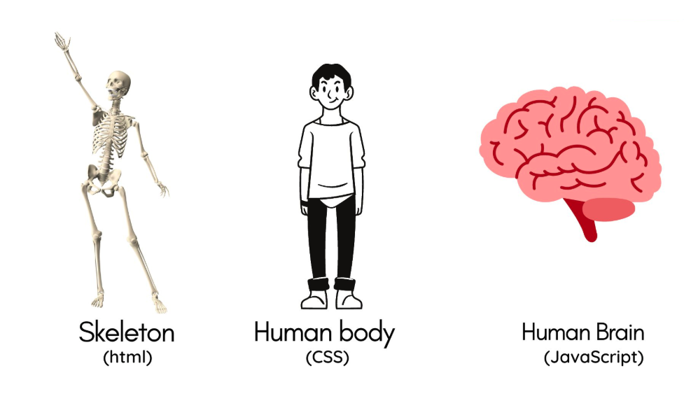
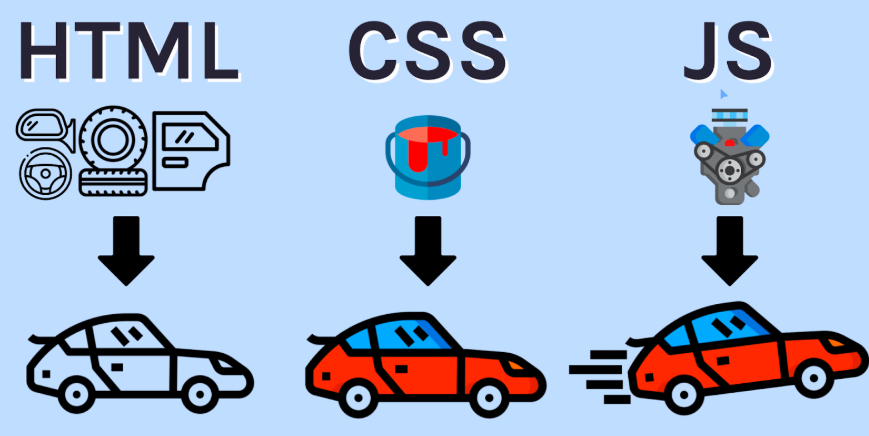
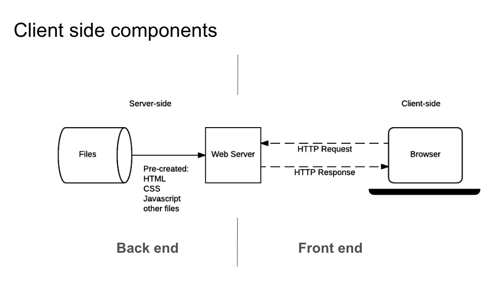
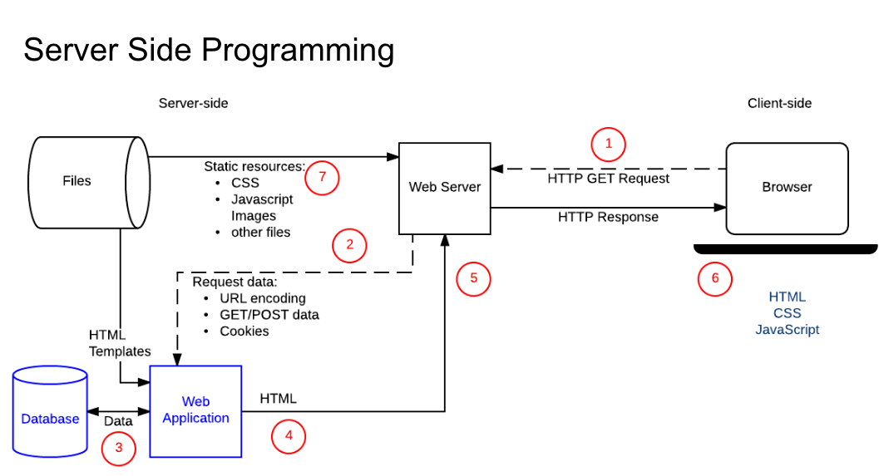
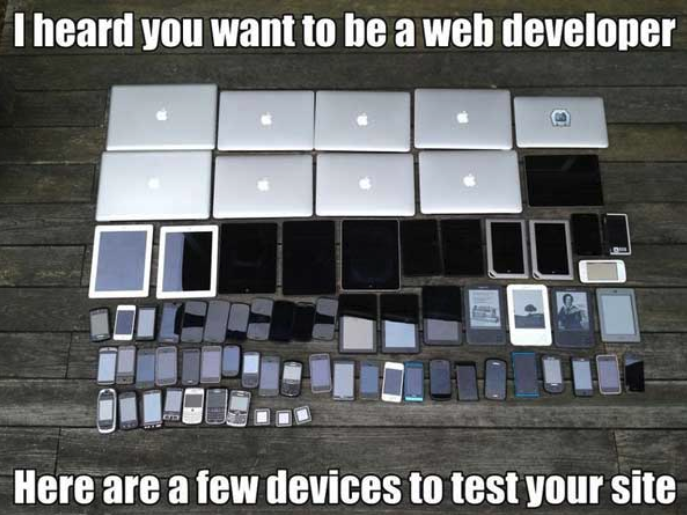

# 第 1 章：Web 應用程式概觀 (Web Overview)

在現今的數位時代，Web 已經從單純的「超文字連結」演變成一個強大的應用程式平台。本章將帶領你建立對 Web 開發的全面認知，從基本概念到現代化的開發架構。

---

## 1.1 什麼是 Web？

對大眾而言，Web 可能像是一份數位雜誌、一座圖書館，或是一個巨大的百貨商場。但從技術角度來看，Web 是基於 **HTTP 協定**、**HTML 規格** 以及 **瀏覽器環境** 所構建的分散式資訊系統。

### Web 的演進
- **Web 1.0 (唯讀時代)**：早期以靜態網頁為主，使用者只能被動接收資訊（如：新聞入口網站）。
- **Web 2.0 (互動時代)**：強調「使用者生成內容 (UGC)」與互動性。社交媒體（FB、IG）、網誌、地圖服務都在此階段蓬勃發展，Web 開始具備應用程式的特性。
- **Web 3.0 (去中心化與智慧時代)**：結合語義網 (Semantic Web)、區塊鏈與人工智慧，強調資料的擁有權與更精準的資訊處理。

> [!TIP]
> **💡 重點觀念**：現代 Web 不僅是資訊的「展示」，更是一個「應用程式執行平台」。許多以前要在電腦安裝軟體才能做的事（如文書處理、修圖、3D 遊戲），現在都能在瀏覽器完成。

---

## 1.2 從網頁到 Web 應用程式：技術的關鍵突破

為什麼現在我們能在瀏覽器跑 Google Docs 甚至大型 3D 遊戲？這得益於幾項網路技術的「核彈級」突破：

1.  **AJAX (非同步通訊)**：在 Google Maps 出現之前，網頁每點一下都要重新整理。AJAX 讓網頁可以在不重新整理的情況下與伺服器交換資料，讓網頁操作變得像桌面軟體一樣流暢。
2.  **HTML5 與圖形加速 (Canvas/WebGL)**：讓瀏覽器具備直接調用顯示卡能力，這也是為什麼瀏覽器能跑複雜的 3D 模型與高品質遊戲。
3.  **WebAssembly (Wasm)**：讓 C++、Rust 等高效能語言編譯後的程式碼能直接在瀏覽器執行。這讓 Google Earth 或影音剪輯工具能以近乎本機軟體的速度運作。
4.  **實時通訊 (WebSockets)**：提供了瀏覽器與伺服器之間的雙向即時連線，這是 Google Docs 多人共同編輯、線上遊戲及聊天軟體的基礎。

### 為什麼 Web 開發如此重要？

-   **跨平台與低門檻**：只要有瀏覽器（Windows, Mac, Linux, iOS, Android），就能執行。使用者不需要安裝任何軟體，只要輸入 URL 即可使用。
-   **即時發佈與更新**：軟體公司修改了某段程式碼，只要重啟伺服器，全世界的使用者重新整理後就是最新版本，不再需要等待 App Store 審核或要求使用者手動下載更新檔。
-   **統一的生態系與標準**：Web 是由開放標準（W3C）定義的，不被單一廠商壟斷。這讓 Web 成為目前傳遞數位服務最公平、也最廣泛的管道。

---

### Web 開發數據 (2025 最新統計)
- **網站總數**：全球約有 **11.2 億至 13.4 億** 個網站，但其中僅約 **15-17%** (約 2 億個) 是處於活躍維護狀態的。平均每天有約 125 萬個新網站誕生。
- **網路人口**：全球上網人口已達 **55.6 億至 60.4 億**，約佔全球總人口的 **68% - 73%**。
- **使用時間**：全球使用者平均每天花費約 **6.5 小時** 在線。
- **熱門語言**：
    - **JavaScript** 穩坐網頁開發首選，幾乎所有現代互動式網站都依賴它。
    - **Python** 在後端開發與 AI 整合中極受歡迎。
    - **PHP** 雖然歷史悠久，但因 WordPress 等內容管理系統的普及，仍驅動著全球約 **73.9%** 的網站。
    - **TypeScript** 因其嚴謹的語法，在大型專案中的採用率快速增長。

> [!NOTE]
> **資料出處**：
> - [DataReportal - Global Digital Insights](https://datareportal.com/reports/digital-2025-global-overview-report)
> - [Forbes - Website Statistics 2025](https://www.forbes.com/advisor/business/software/website-statistics/)
> - [Statista - Internet usage worldwide](https://www.statista.com/topics/1145/internet-usage-worldwide/)

---

## 1.2 Web 架構：前後端分離

現代 Web 應用多採用「前後端分離 (Decoupled Architecture)」的設計模式，這讓開發更具規模化與靈活性。

### 1. 前端開發 (Front-End) - 「使用者看到的」
前端（又稱客戶端，Client-side）負責使用者介面 (UI) 與使用者體驗 (UX)。
- **核心職責**：設計直覺的介面、確保在不同裝置（手機、平板、桌機）上的響應式佈局 (Responsive Design)、提升互動順暢度。
- **三大支柱**：
    - **HTML (骨架)**：定義內容的結構。
    - **CSS (皮肉)**：負責視覺風格與版面裝飾。
    - **JavaScript (靈魂)**：處理動態互動與資料邏輯。

> [!NOTE]
> **💡 重點觀念**：前端的核心是「展示」與「互動」。即使擁有強大的後端，若前端設計不佳，使用者也會因為難以操作而放棄。

### 2. 後端開發 (Back-End) - 「幕後的運作」
後端（又稱伺服器端，Server-side）負責處理邏輯、資料庫互動與整合。
- **核心職責**：管理資料庫、實作伺服器運算邏輯、確保系統安全性、提供 API 供前端呼叫。
- **關鍵技術**：
    - **語言**：Python (Django/Flask), JavaScript (Node.js), Java (Spring), PHP, Go 等。
    - **資料庫**：MySQL, PostgreSQL (關聯式); MongoDB (非關聯式)。

> [!NOTE]
> **💡 重點觀念**：後端的核心是「資料處理」與「安全性」。它負責保護使用者隱私並確保資料的正確性與一致性。

---

## 1.4 現代 Web 開發的渲染策略 (Rendering Strategies)

作為資工系學生，你需要理解資料是如何「變成」你看到的畫面的。這不僅關係到使用者體驗，更影響到搜尋引擎優化 (SEO) 與伺服器負載。

1.  **客戶端渲染 (CSR, Client-Side Rendering)**：
    -   **機制**：伺服器只回傳一個空的 HTML 殼和一大袋 JavaScript。瀏覽器執行 JS 後才去抓資料並渲染畫面。
    -   **代表**：React, Vue, Angular 的預設模式。
    -   **優點**：頁面切換極快，像 App 一樣。
2.  **伺服器端渲染 (SSR, Server-Side Rendering)**：
    -   **機制**：伺服器先跑好程式、抓好資料、生成完整的 HTML 才送給瀏覽器。
    -   **代表**：Next.js, Nuxt.js, 或傳統的 Django/PHP。
    -   **優點**：SEO 極佳，使用者能更早看到內容。
3.  **靜態生成 (SSG, Static Site Generation)**：
    -   **機制**：在「編譯階段」就直接產生數千個 HTML 檔案，使用者存取時伺服器不用運算直接給。
    -   **優點**：效能最高、最安全，適合網誌或文件導向的網站。

---

## 1.5 資料交換與 API 通訊模式

Web 應用程式之間是如何交談的？目前業界有幾種主流標準：

-   **RESTful API**：目前最通用的標準，基於 HTTP 方法 (GET, POST...) 與狀態碼。
-   **GraphQL**：讓前端可以「精確指定」需要的資料欄位，減少網路傳輸量，由 Meta 開發。
-   **gRPC**：基於 Protocol Buffers 與 HTTP/2，主要用於微服務之間的高效能內部通訊。
-   **WebSockets**：如同前述，用於雙向即時通訊。

---

## 1.6 現代開發工具與 DevOps 生態 (The Tooling)

除了寫程式，資工專業人士還需要掌握開發流程 (Workflow) 的自動化：

1.  **套件管理 (Package Management)**：如 `npm`, `yarn`, `pip`。用於管理專案的第三方套件依賴。
2.  **建置工具 (Build Tools)**：如 `Vite`, `Webpack`。負責處理程式碼的混淆 (Minification)、熱重載 (Hot Reload) 與打包。
3.  **容器化 (Containerization)**：**Docker**。確保你的 Web 應用在任何環境（你的筆電、伺服器、雲端）都能跑出一模一樣的結果。
4.  **CI/CD 流水線**：每次你 commit 程式碼後，自動執行測試、自動掃描安全漏洞、自動部署到正式環境。
5.  **基礎設施即程式碼 (IaC)**：使用代碼來管理雲端資源 (AWS, GCP, Azure)。

---

## 1.7 為什麼需要架構 (Frameworks)？

在專業開發中，我們很少從零開始寫每一行程式碼，而是會使用「框架」來提升效率。

### 框架的優點
- **效率 (Efficiency)**：提供現成的解決方案（如路由、登入系統）。
- **模組化 (Modularity)**：強迫開發者寫出更易於維護的乾淨程式碼。
- **社群支援**：大量的文件與插件，遇到問題容易找到解決方案。

### 常用框架一覽
- **前端**：**React** (靈活的組件化), **Vue.js** (易上手), **Angular** (功能完整的重量級框架)。
- **後端**：**Django** (Python 領域最完整的框架), **Express** (Node.js 最輕量的選擇), **Laravel** (PHP 界的優美代表)。

> [!WARNING]
> **⚠️ 小提示**：框架雖然強大，但也有一定的學習成本。初學者應先打好 HTML/CSS/JS 的基礎，再進入框架的領域，否則容易在複雜的概念中迷失。

---

## 1.8 優質 Web 應用的特質 (User View)

一個成功的 Web 應用不只要功能正確，更要具備以下特質：
1. **簡單清爽 (Clean UI)**：不讓使用者感到混亂。
2. **極速響應 (Performance)**：載入超過 3 秒，使用者就會流失。
3. **行動優先 (Mobile-First)**：現代大部分流量來自手機。

4. **包容性 (Accessibility)**：應讓身障人士也能順暢使用。
5. **友善的報錯 (Error Handling)**：發生錯誤時，給予有建設性的提示，而非冰冷的程式碼噴錯。

---

> [!TIP]
> **💡 重點觀念**：學習 Web 開發不只是學程式語言，更是學會如何組織資料與優化使用者體驗。接下來的章節，我們將深入探討 Web 通訊的靈魂：HTTP 協定。

---

## ✍️ 自我測驗 (Self-Test)

**Q1: 下列哪項技術被稱為網頁的「骨架」？**
A) CSS
B) JavaScript
C) HTML
D) Python

**Q2: Web 2.0 與 Web 1.0 最大的區別在於？**
A) 圖片畫質更高
B) 美觀程度
C) 使用者的參與程度與內容互動性
D) 只有電腦能運行

**Q3: 「前後端分離」架構的主要優點之一是？**
A) 程式碼變長了
B) 前後端開發可以獨立進行，靈活性更高
C) 不需要資料庫
D) 瀏覽器會執行得更快

▶️ 點擊查看解答

Q1: C | Q2: C | Q3: B

---

## 🛠️ 實作演練 (Practical Exercises)

### 任務 1：網頁原始碼大拆解
1. 在任何網頁（例如你的學校首頁）點擊滑鼠右鍵，選擇 **「檢視網頁原始碼」 (View Page Source)**。
2. 試著在程式碼中尋找 `<title>`、`<h1>` 或 `` 等標籤。
3. **思考題**：你在原始碼中看到的是資料的「結構」還是「樣式」？

### 任務 2：行動裝置模擬器
1. 打開 Chrome 開發者工具 (F12)。
2. 點擊工具列左上角的 **裝置工具列 (Toggle Device Toolbar)** 圖示（手機與平板圖案）。
3. 在上方選單切換不同的裝置（如 iPhone 或 Pixel），觀察網頁排版是如何自動調整的。
4. 這就是我們提到的 **響應式技術 (Responsive Web Design)**。
