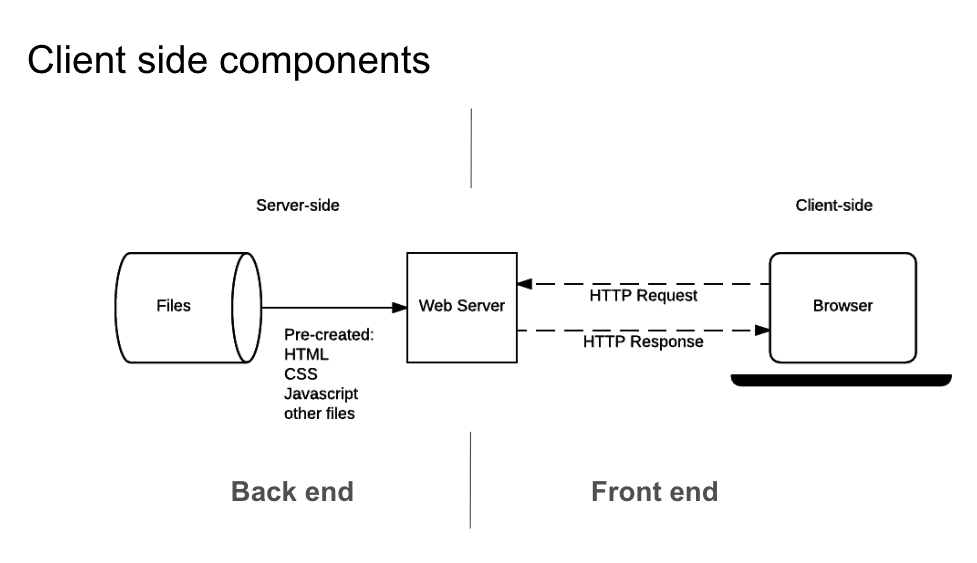
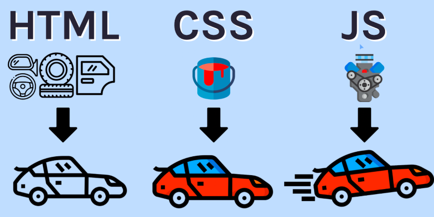
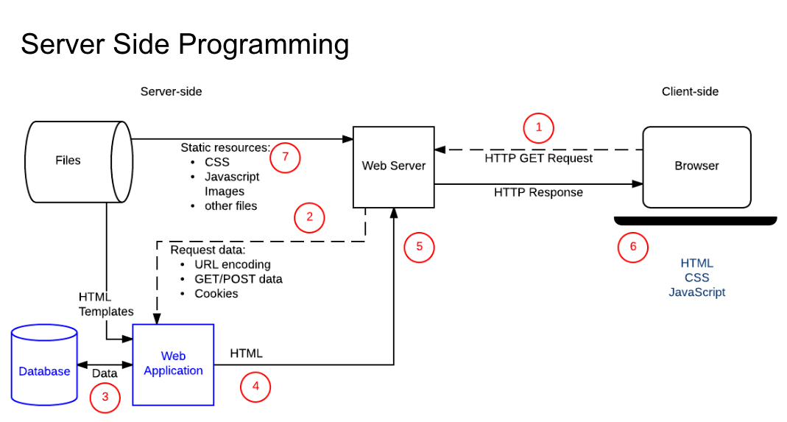

# 第 1 章：Web 應用程式概觀 (Web Overview)

在現今的數位時代，Web 已經從單純的「超文字連結」演變成一個強大的應用程式平台。本章將帶領你建立對 Web 開發的全面認知，從基本概念到現代化的開發架構。

---
## Web application
[nlh Slide](https://docs.google.com/presentation/d/1AjFtOvU5wBIwHExzj7kuFVmzIDYxy2nCyF0xjrgm0-o/edit?usp=sharing)
* What is Web
* Web Architecture: Front-end and Back-end
* Front-End Language and Framework: HTML, CSS, JS
* Back-End Framework

---

## 1.1 什麼是 Web？

Web 是一個運行在網際網路之上的**應用層分散式系統**。它由以下四個核心支柱構成：

1. **統一資源定位與抽象化** (URI/URL): Web 的基礎在於其**資源導向（Resource-Oriented）」** 的本質。每一個資訊實體（無論是 HTML 文本、JSON 數據、圖像或是物聯網感測器數值）都被抽象為一個 **URI (Uniform Resource Identifier)**。
   * 實現了全球範疇內的命名空間統一，使得跨地理、跨系統的資訊引用成為可能。

2. **無狀態的傳輸協議** (HTTP/HTTPS): Web 的通訊基礎是基於 **HTTP (Hypertext Transfer Protocol)**。這是一種應用層的、**無狀態（Stateless）**且**請求-回應（Request-Response）**驅動的協定。
   * 從早期的 HTTP/1.1 序列傳輸，到現代 HTTP/2 的多路復用（Multiplexing），再到 HTTP/3 的 QUIC 協議（減少延遲），這決定了數據交換的效率與穩定性。

3. **超文字標記語言與渲染引擎** (HTML & Rendering Engines): Web 提供了一套跨平台的**展示標準（HTML/CSS/JS）**。
    * 定義了資訊的**結構（Structure）**與**表現（Presentation）**。瀏覽器（如 Chromium 核心）扮演了虛擬機器的角色，將純文本的標記碼解析為動態的渲染樹（Render Tree），解決了不同操作系統間的軟體相容性問題。

4. **超連結性與網狀架構 (Hyperlinkage & Graph Structure)**: Web 與傳統檔案系統最大的差別在於其 **「非線性」**。透過超連結（Hyperlink），Web 構成了一個全球性的**有向圖（Directed Graph）**。
   * **技術觀察**：這也是搜尋引擎演算法（如 PageRank）的理論基礎——透過分析圖結構中的節點權重來評估資訊價值。

對大眾而言，Web 可能像是一份數位雜誌、一座圖書館，或是一個巨大的百貨商場。但從技術角度來看，Web 是基於 **HTTP 協定**、**HTML 規格** 以及 **瀏覽器環境** 所構建的分散式資訊系統。

---

### Web 的三維演進觀點

| 維度 | **Web 1.0** | **Web 2.0** | **Web 3.0** |
| --- | --- | --- | --- |
| **數據流向** | 單向 (Read-only) | 雙向交互 (Read-Write) | 所有權與理解 (Read-Write-Own) |
| **技術特徵** | 靜態 HTML / CGI | 資料庫 / 互動 | 語意標籤 / 區塊鏈 / 知識圖譜 |
| **通訊模式** | 文件檢索 | 應用服務 / API 呼叫 | 數據聯網 / 自動化推理 |

Web 演進：從資訊接收到智慧自主：

* **Web 1.0 (Read - 唯讀時代)**
  * **核心**：靜態網頁、單向傳遞。
  * **特徵**：以 **「HTML 靜態頁面」** 為主，使用者如同在閱讀電子佈告欄（如：早期 Yahoo、新聞入口網站），互動極少。

* **Web 2.0 (Read-Write - 互動時代)**
  * **核心**：使用者生成內容 (UGC)、社群平台。
  * **特徵**：由 **「資料庫驅動 (Database-driven)」** 的動態系統。Web 轉變為應用程式（SaaS），強調雙向互動與數據交換（如：FB、IG、Google Maps），資料所有權掌握在巨頭手中。

* **Web 3.0 (Read-Write-Own - 智慧與去中心化時代)**
  * **核心**：價值互聯、具身智能、去中心化。
  * **特徵**：結合 **區塊鏈 (產權)** 與 **人工智慧 (決策)**。
  * **進化**：資訊不再只是被搜尋，而是被 **AI Agent (自動化代理)** 處理。Web 3.0 不僅是語義網，更是機器人與 AI 能夠理解並執行任務的環境。例如：透過低軌衛星連網的 **人形機器人**，能自主調用 Web 3.0 協議進行支付與物資採購，實現真正意義上的「智慧自主」。

> [!TIP]
> **💡 重點觀念**：現代 Web 不僅是資訊的「展示」，更是一個「應用程式執行平台」。許多以前要在電腦安裝軟體才能做的事（如文書處理、修圖、3D 遊戲），現在都能在瀏覽器完成。

### Web 開發的盛行

-   **跨平台與低門檻**：只要有瀏覽器（Windows, Mac, Linux, iOS, Android），就能執行。使用者不需要安裝任何軟體，只要輸入 URL 即可使用。
-   **即時發佈與更新**：軟體公司修改了某段程式碼，只要重啟伺服器，全世界的使用者重新整理後就是最新版本，不再需要等待 App Store 審核或要求使用者手動下載更新檔。
-   **統一的生態系與標準**：Web 是由開放標準（W3C）定義的，不被單一廠商壟斷。這讓 Web 成為目前傳遞數位服務最公平、也最廣泛的管道。

**Web 開發數據 (2025 最新統計)**
- **網站總數**：全球約有 **11.2 億至 13.4 億** 個網站，但其中僅約 **15-17%** (約 2 億個) 是處於活躍維護狀態的。平均每天有約 125 萬個新網站誕生。
- **網路人口**：全球上網人口已達 **55.6 億至 60.4 億**，約佔全球總人口的 **68% - 73%**。
- **使用時間**：全球使用者平均每天花費約 **6.5 小時** 在線。
- **熱門語言**：
    - **JavaScript** 穩坐網頁開發首選，幾乎所有現代互動式網站都依賴它。
    - **Python** 在後端開發與 AI 整合中極受歡迎。
    - **PHP** 雖然歷史悠久，但因 WordPress 等內容管理系統的普及，仍驅動著全球約 **73.9%** 的網站。
    - **TypeScript** 因其嚴謹的語法，在大型專案中的採用率快速增長。

---

## 1.2 前後端分離的網頁架構

現代 Web 應用多採用「前後端分離 (Decoupled Architecture)」的設計模式，這讓開發更具規模化與靈活性。

### 1. 前端開發 (Front-End) - 「使用者看到的」
前端（又稱客戶端，Client-side）負責使用者介面 (UI) 與使用者體驗 (UX)。
- **核心職責**：設計直覺的介面、確保在不同裝置（手機、平板、桌機）上的響應式佈局 (Responsive Design)、提升互動順暢度。
- **三大支柱**：
    - **HTML (骨架)**：定義內容的結構。
    - **CSS (皮肉)**：負責視覺風格與版面裝飾。
    - **JavaScript (靈魂)**：處理動態互動與資料邏輯。

> [!NOTE]
> **💡 重點觀念**：前端的核心是「展示」與「互動」。即使擁有強大的後端，若前端設計不佳，使用者也會因為難以操作而放棄。

### 2. 後端開發 (Back-End) - 「幕後的運作」
後端（又稱伺服器端，Server-side）負責處理邏輯、資料庫互動與整合。
- **核心職責**：管理資料庫、實作伺服器運算邏輯、確保系統安全性、提供 API 供前端呼叫。
- **關鍵技術**：
    - **語言**：Python (Django/Flask), JavaScript (Node.js), Java (Spring), PHP, Go 等。
    - **資料庫**：MySQL, PostgreSQL (關聯式); MongoDB (非關聯式)。

> [!NOTE]
> **💡 重點觀念**：後端的核心是「資料處理」與「安全性」。它負責保護使用者隱私並確保資料的正確性與一致性。

**前端 vs. 後端架構對照表**

| 比較重點 | 前端開發 (Frontend / Client-side) | 後端開發 (Backend / Server-side) |
| --- | --- | --- |
| **主要工作** | **「面子」**：負責視覺配置、使用者互動體驗、排版與動畫。 | **「裡子」**：負責資料處理、商業邏輯、資料庫管理、安全性與身份驗證。 |
| **使用語言** | **HTML, CSS, JavaScript**。 | **Python (Django)**, Java (Spring), JS (Node.js), PHP, Go, Ruby。 |
| **使用者互動** | 直接互動：點擊按鈕、滑動選單、表單即時驗證。 | 間接互動：接收請求（Request）、處理資料、回傳結果（Response）。 |
| **運行環境** | **使用者瀏覽器** (Chrome, Safari, Edge)。 | **雲端伺服器** (Google Cloud Run, Railway, AWS)。 |
| **核心目標** | 易用性、美觀、跨裝置相容性（響應式設計）。 | 穩定性、資料正確性、效能、安全性。 |
| **開發框架** | React, Vue, Tailwind CSS, Bootstrap。 | **Django**, Express, FastAPI, Laravel。 |

---

#### 為什麼要「前後端分離」？

從軟體工程的角度看，將「展示層」與「邏輯層」切開有三個核心原因：

* **專業分工 (Specialization)**：前端工程師可以專注於 **瀏覽器渲染效能、UX 互動與跨裝置相容性**；後端工程師則能專注於 **高併發處理、資料庫優化與演算法設計**。
* **多端共用 (One Backend, Multiple Clients)**：同一個 Django 後端 可以同時支援「網頁版 (React/Template)」、「手機 App (iOS/Android)」以及「IoT 裝置」，而不需為每個平台重寫邏輯。
* **獨立部署與擴展 (Scalability)**：如果促銷活動導致流量暴增，我們可以只增加「前端伺服器」的數量來承載流量，而不需要動到核心資料庫邏輯。

### 前端 (Frontend)：互動與感知

前端不只是「畫圖」，它更像是一個 **「翻譯官」**。

* **狀態管理**：記錄使用者現在選了哪件衣服、什麼尺寸。
* **輸入驗證 (First Line of Defense)**：在資料送出前，先檢查 Email 格式是否正確，減少不必要的後端請求。
* **非同步通訊 (AJAX/HTMX)**：確保使用者點擊「加入購物車」時，頁面不會整頁刷新，維持流暢感。

### 後端 (Backend)：規則與守護

後端是系統的 **「大腦與保險箱」**。

* **商業邏輯 (Business Logic)**：例如「滿千折百」的計算、庫存是否真的足夠（不能只聽前端的）。
* **安全性 (Security)**：防止 SQL 注入攻擊、驗證使用者是否真的登入。
* **持久化 (Persistence)**：將資料安全地存入資料庫（如 PostgreSQL），確保電腦斷電後訂單不會消失。

---

### 3. 情境演練：從「挑選商品」到「下單付款」

讓我們看看一個學生在購物網站上的完整旅程，前後端如何各司其職：

### 第一階段：瀏覽與挑選 (前端)

1. **使用者行為**：學生在搜尋框輸入「Django 教科書」。
2. **前端動作**：**Tailwind** 處理搜尋框的伸縮動畫；**JS/HTMX** 捕捉輸入內容並發送請求。
3. **後端動作**：**Django** 接收請求，去資料庫（Database）搜尋關鍵字，將結果過濾後回傳。
4. **呈現**：前端收到結果，動態更新頁面，學生看到漂亮的書本清單（RWD 響應式佈局）。

### 第二階段：加入購物車 (互動)

1. **使用者行為**：點擊「加入購物車」。
2. **前端動作**：顯示「已加入」的氣泡通知（Toast）。
3. **後端動作**：檢查庫存。如果有貨，在伺服器端更新該使用者的 **Session** 或資料庫。**這是關鍵：不能只在前端顯示加一，後端必須同步記錄，否則重新整理頁面購物車就空了。**

### 第三階段：結帳與付款 (安全性核心)

1. **使用者行為**：按下「確認下單」。
2. **前端動作**：收集收件人資訊，進行基本的表單檢查。
3. **後端動作 (最忙的時候)**：
* **身份驗證**：確認這筆訂單是「王大明」本人下的。
* **交易原子性 (Atomicity)**：確保「扣除庫存」與「建立訂單」這兩個動作同時成功，不能庫存扣了訂單卻沒產生。
* **外部對接**：呼叫第三方支付（如 LINE Pay/Stripe）的 API。

4. **結果回傳**：支付成功後，後端回傳一個「成功頁面」或 JSON。

### 第四階段：完成頁面 (回到前端呈現)

1. **前端動作**：跳轉到感謝頁面，隱藏結帳表單，並發送一封「訂單確認」的通知給使用者。

---

### 前端框架

前端的框架常見如下：

- **前端框架 / 庫**  
   - 功能：幫助建立使用者介面、處理 DOM、資料綁定與元件化。  
   - 代表：React、Vue、Angular、Svelte、jQuery（較早期）。
- **CSS 框架 / 設計系統**
   - 功能：提供預設樣式、響應式格線、元件樣式，快速排版與佈局。  
   - 代表：Bootstrap、Tailwind CSS、Bulma、Foundation、Material UI。

前端框架的比較：
| 特性 | **React** | **Vue** | **Svelte** | **jQuery** |
| --- | --- | --- | --- | --- |
| **核心定位** | UI 函式庫 (Library) | 漸進式框架 (Framework) | 編譯器 (Compiler) | DOM 操作工具庫 |
| **學習曲線** | **中/高** (需熟悉 JS/JSX) | **低/中** (模板語法直覺) | **低** (接近原生 HTML/JS) | **極低** (隨插即用) |
| **資料綁定** | 單向資料流 (One-way) | 雙向資料流 (Two-way) | 響應式聲明 (Reactive) | 手動 DOM 更新 |
| **渲染機制** | **Virtual DOM** | **Virtual DOM** | **無 Virtual DOM** (直接編譯) | 直接操作實體 DOM |
| **程式碼結構** | 組件化 (JSX/TSX) | SFC (單檔案組件 `.vue`) | 原生 HTML/CSS/JS 組合 | 腳本式操作 (Selector) |
| **效能** | 高 (需優化 Hooks) | 高 (內建優化) | **極高** (運行時負擔極小) | 低 (頻繁操作實體 DOM) |
| **代表公司** | Meta (Facebook) | 開源社群 | 開源社群 | 已逐漸退出主流開發 |

**QA**

- 為什麼我們「不選」React/Vue？
  * **複雜度過高**：React 需要學習 Webpack/Vite 打包、NPM 生態系、以及複雜的狀態管理（Redux/Zustand），這會分散學生學習後端邏輯的精力。
  * **與 MVT 衝突**：React 傾向於 CSR（客戶端渲染），這會讓 Django 的 Template 功能變得形同虛設。

- 為什麼 jQuery 已經是「過去式」？

  * **維護困難**：jQuery 讓程式碼散落在各處，當專案變大時，DOM 操作會變得像「義大利麵」一樣混亂。
  * **HTMX 的上位替代**：HTMX 能夠以更優雅、更符合宣告式（Declarative）的方式達成 jQuery 以前在做的事情，而且程式碼行數少非常多。

* Svelte 的「不使用 Virtual DOM」與「回歸原生 HTML」的理念，與 **HTMX** 其實有異曲同工之妙。它們都追求更輕量、更直覺的網頁開發。

> 「React 和 Vue 像是**全自動工廠**，雖然強大但設定繁瑣；jQuery 像是**手動工具箱**，現在已經太慢了。我們選擇的 **HTMX + Django** 組合，則是**精悍的改裝車**——我們保留了伺服器端（SSR）的穩定與安全，同時具備了現代框架的流暢感。」

#### CSS 框架的比較

在 2026 年，前端開發已經從「套用現成元件」轉向「自由組合工具類別（Utility-first）」。

| 特性 | **Bootstrap** | **Tailwind CSS** | **Bulma** | **Material UI (MUI)** |
| --- | --- | --- | --- | --- |
| **核心哲學** | **元件導向 (Component)** | **工具導向 (Utility)** | **純 CSS / Flexbox** | **設計系統 (Design System)** |
| **開發方式** | 套用 `class="btn btn-primary"` | 組合 `class="bg-blue-500 p-4"` | 套用 `class="button is-link"` | 使用 React/Vue 組件 |
| **學習曲線** | **極低** (背組件名稱即可) | **中** (需熟悉 CSS 屬性) | **低** (語意化命名) | **高** (需綁定特定框架) |
| **自訂化程度** | 低 (容易產生「罐頭感」) | **極高** (完全自由組合) | 中 | 中 (需透過主題設定) |
| **檔案體積** | 較大 (包含大量未用樣式) | **極小** (自動移除未用代碼) | 中 | 較大 (包含 JS 邏輯) |
| **JavaScript 依賴** | **需要** (用於彈窗、下拉選單) | **不需要** (純 CSS) | 不需要 (純 CSS) | **必須** (與 React 深度整合) |

---

**QA**
1. 為什麼 Bootstrap 是傳統的「黑盒」元件
    * 開發者往往不知道為什麼 `btn` 會長那樣，對底層 CSS 的 `box-model` 或 `flex` 缺乏理解。且因為需要 JS 驅動組件，有時會與 **Django + HTMX** 的動態機制產生衝突（例如：HTMX 載入新內容後，Bootstrap 的彈窗功能失效）。

#### Web 前端的渲染策略 

1.  **客戶端渲染 (CSR, Client-Side Rendering)**：
    -   **機制**：伺服器只回傳一個空的 HTML 殼和一大袋 JavaScript。瀏覽器執行 JS 後才去抓資料並渲染畫面。
    -   **代表**：React, Vue, Angular 的預設模式。
    -   **優點**：頁面切換極快，像 App 一樣 (JS 下載完成後)。
2.  **伺服器端渲染 (SSR, Server-Side Rendering)**：
    -   **機制**：伺服器先跑好程式、抓好資料、生成完整的 HTML 才送給瀏覽器。
    -   **代表**：Django, PHP, Next.js, Nuxt.js。
    -   **優點**：SEO 極佳，使用者能更早看到內容。
3.  **靜態生成 (SSG, Static Site Generation)**：
    -   **機制**：在「編譯階段」就直接產生數千個 HTML 檔案，使用者存取時伺服器不用運算直接給。
    -   **優點**：效能最高、最安全，適合網誌或文件導向的網站。

簡單來說，SSR 直接把煮好的「熱菜（完整網頁）」送上桌，讓使用者和搜尋引擎一眼就能吃到內容，不必像 CSR 還要等客人在桌上自己開火動手煮（執行 JS），速度快且更有層次感。    

相較於 CSR, 傳統 SSR (Django)的缺點：點擊連結 $\rightarrow$ 瀏覽器向 Server 請求新頁面 $\rightarrow$ Server 重新跑一次 MVT $\rightarrow$ 瀏覽器重新刷新 (Refresh) 並畫出整個網頁（畫面會閃一下白屏）。HTMX 的出現，就是想讓 Django (SSR) 也能擁有這種「不刷新頁面、極快切換」的優點，但又不需要去學 CSR 複雜的「下載一大袋 JS」的流程。

### 後端框架

#### Django

---

## 網頁框架 (Frameworks)

在專業開發中，我們很少從零開始寫每一行程式碼，而是會使用「框架」來提升效率。

### 框架的優點
- **效率 (Efficiency)**：提供現成的解決方案（如路由、登入系統）。
- **模組化 (Modularity)**：強迫開發者寫出更易於維護的乾淨程式碼。
- **社群支援**：大量的文件與插件，遇到問題容易找到解決方案。

### 框架的分類

在 **Web 開發**的領域裡，常見的框架（framework）大致可依用途與層級分為幾大類型：

1. **前端框架 / 庫**  
   - 功能：幫助建立使用者介面、處理 DOM、資料綁定與元件化。  
   - 代表：React、Vue、Angular、Svelte、jQuery（較早期）。

2. **後端框架**  
   - 功能：建構伺服器端應用、路由、資料庫存取、認證與 API。  
   - 代表：Express、Django、Ruby on Rails、Laravel、Spring、ASP.NET Core。

3. **全端框架**  
   - 功能：同時包含前後端功能，讓開發者在一個統一環境開發整個應用。  
   - 代表：Next.js、Nuxt.js、Meteor、Blitz.js。

4. **CSS 框架 / 設計系統**  
   - 功能：提供預設樣式、響應式格線、元件樣式，快速排版與佈局。  
   - 代表：Bootstrap、Tailwind CSS、Bulma、Foundation、Material UI。

5. **測試框架**  
   - 功能：撰寫與執行測試，確保程式正確性。  
   - 前端／全端：Jest、Mocha、Cypress、Jasmine、Playwright；  
   - 後端：RSpec（Ruby）、pytest（Python）、JUnit（Java）等。

6. **構建 / 打包工具**（有時稱為「開發框架」）  
   - 功能：編譯、打包、熱更新與資源優化。  
   - 代表：Webpack、Parcel、Vite、Rollup。

> [!WARNING]
> **⚠️ 小提示**：框架雖然強大，但也有一定的學習成本。初學者應先打好 HTML/CSS/JS 的基礎，再進入框架的領域，否則容易在複雜的概念中迷失。

---

## 1.4 現代開發工具與 DevOps 生態

除了寫程式，資工專業人士還需要掌握開發流程 (Workflow) 的自動化：

1.  **套件管理 (Package Management)**：如 `npm`, `yarn`, `pip`。用於管理專案的第三方套件依賴。
2.  **建置工具 (Build Tools)**：如 `Vite`, `Webpack`。負責處理程式碼的混淆 (Minification)、熱重載 (Hot Reload) 與打包。
3.  **容器化 (Containerization)**：**Docker**。確保你的 Web 應用在任何環境（你的筆電、伺服器、雲端）都能跑出一模一樣的結果。
4.  **CI/CD 流水線**：每次你 commit 程式碼後，自動執行測試、自動掃描安全漏洞、自動部署到正式環境。
5.  **基礎設施即程式碼 (IaC)**：使用代碼來管理雲端資源 (AWS, GCP, Azure)。

---

## 好的網頁系統
要開發一個「好的網頁系統」，不僅是技術的堆疊，更是**「以人為本」的設計哲學**

### 1. 使用者友善介面 (User-Friendly Interface)

**核心目標：降低認知負荷。**

* **延伸說明：** 一個好的介面不代表「功能少」，而是要讓功能「出現得理所當然」。學生應練習 **視覺層次 (Visual Hierarchy)** 的排版，利用大小、顏色與間距來引導使用者的視線，讓首要任務（如：登入、購買）能在 3 秒內被找到。
* **實踐目標：** 學習使用白平衡（White Space），避免資訊過載；建立一套明確的 Icon 與標題系統。

### 2. 快速反應性 (Responsiveness / Performance)

**核心目標：零挫折的操作感。**

* **延伸說明：** 這裡指的不是版型縮放，而是**系統的回應速度**。根據研究，延遲超過 100 毫秒就會讓人類感知到「慢」。學生應關注 **關鍵渲染路徑 (Critical Rendering Path)**，優化圖片大小、減少重複的 API 請求。
* **實踐目標：** 導入 Loading 骨架屏 (Skeleton Screens) 或進度條；學習資料庫索引（Indexing）優化後端查詢速度。

### 3. 行動裝置友善 (Mobile-Friendliness)

**核心目標：跨裝置的無縫體驗。**

* **延伸說明：** RWD (響應式設計) 只是基本，更進階的是 **「指尖友善」 (Touch-Friendly)**。按鈕是否夠大？選單在手機上是否容易收合？是否考慮過手機網路不穩時的斷線處理？
* **實踐目標：** 採用 Mobile-First（行動優先）開發思維，熟悉 CSS Grid 或 Flexbox，並練習在不同解析度下隱藏非必要的次要資訊。

### 4. 一致性 (Consistency)

**核心目標：降低學習曲線。**

* **延伸說明：** 系統內的所有按鈕風格、色彩代碼、間距與字體都應該統一。這能建立使用者的「操作慣性」，讓他在 A 頁面學會的動作，能直覺應用在 B 頁面。
* **實踐目標：** 學習建立 **Design System (設計規範)** 或使用 UI 組件庫（如 MUI, Tailwind CSS），並練習定義全域變數（Global Variables）。

### 5. 個人化體驗 (Personalization)

**核心目標：從「大眾系統」進化為「我的系統」。**

* **延伸說明：** 好的系統能記住使用者的喜好。這不只是推薦商品，也包含深色模式切換、記住上次閱讀位置、或是根據使用者權限顯示不同的功能面板。
* **實踐目標：** 學習如何安全地使用 LocalStorage、Cookies 或後端資料庫來儲存使用者偏好設定。

### 6. 清晰度與視覺可見性 (Clarity and Visibility)

**核心目標：所見即所得，行動有預期。**

* **延伸說明：** 每個可點擊的元素都應該「看起來可點擊」。狀態回饋也非常重要，例如按鈕點擊後的顏色變化、上傳檔案時的百分比顯示。使用者不應猜測「系統現在在幹嘛」。
* **實踐目標：** 學習 **「狀態管理」 (State Management)**，確保 UI 永遠與資料庫的真實狀態同步。

### 7. 無障礙環境 (Accessibility / A11y)

**核心目標：不讓任何一個使用者掉隊。**

* **延伸說明：** 這是專業開發者與業餘愛好者的分水嶺。包含圖片的 Alt 標籤（讓視障者讀取）、足夠的色彩對比度、以及完全可透過「鍵盤 (Tab鍵)」操作的功能。
* **實踐目標：** 練習使用語意化 HTML 標籤（如 `<main>`, `<nav>`, `<footer>`），並使用無障礙檢測工具（如 Lighthouse）進行測試。

### 8. 友善的錯誤處理 (Helpful Error Handling)

**核心目標：化解危機，指引方向。**

* **延伸說明：** 永遠不要只顯示 `Error 404` 或 `Invalid input`。好的系統會告訴使用者「哪裡錯了」以及「如何修正」。例如：密碼少了一個大寫字母，應直接標註出來，而非清空所有欄位讓使用者重填。
* **實踐目標：** 撰寫具備導引性的錯誤訊息，並在前端實作即時驗證（Validation），避免使用者送出後才發現錯誤。

---
## 1.6 常見名詞解釋 (Glossary)

在 Web 開發的世界裡，你會不斷聽到以下術語。建立正確的初步認知非常重要：

-   **DOM (Document Object Model)**：文件物件模型。瀏覽器將 HTML 解析後生成的樹狀結構，是 JavaScript 操控網頁內容的橋樑。
-   **SPA (Single Page Application)**：單頁應用程式。使用者在操作時不會感覺到整個頁面跳轉（重新整理），而是透過 JS 動態替換局部內容（如：Facebook, Gmail）。
-   **SEO (Search Engine Optimization)**：搜尋引擎優化。透過技術手段讓網站更容易被 Google 搜到並排在前面。
-   **RWD (Responsive Web Design)**：響應式網頁設計。讓網頁能自動適應手機、平板、電腦等各種螢幕尺寸。
-   **JSON (JavaScript Object Notation)**：目前 Web 最主流的輕量級資料交換格式，易於人類閱讀也易於機器解析。
-   **API (Application Programming Interface)**：應用程式介面。兩個系統之間溝通的約定，就像餐廳的菜單。

---

## 1.6 常見問題 Q&A

**Q: 「框架 (Framework)」與「函式庫 (Library)」有什麼差別？**
- **A**：關鍵在於「控制權」。函式庫是你呼叫它（你掌控流程）；框架是它呼叫你（它規定好結構，你把代碼填進去），這在軟體工程中稱為「控制反轉 (IoC)」。

**Q: 我應該先學前端還是後端？**
- **A**：資工系學生建議都學！但可以從「興趣」出發。如果你喜歡視覺反饋與直覺互動，從前端開始；如果你喜歡邏輯處理、大型架構與資料運算，從後端開始。

**Q: Web 可以拿來開發「桌面軟體」或「App」嗎？**
- **A**：可以。透過 **Electron** 技術，可以用 Web 技術開發桌面軟體（如 VS Code、Discord 都是 Web 技術做的）；透過 **PWA** 或 **React Native** 等技術，也能將 Web 邏輯延伸至手機端。

---

> [!TIP]
> **💡 重點觀念**：學習 Web 開發不只是學程式語言，更是學會如何組織資料與優化使用者體驗。接下來的章節，我們將深入探討 Web 通訊的靈魂：HTTP 協定。

---

## ✍️ 自我測驗 (Self-Test)

**Q1: 下列哪項技術被稱為網頁的「骨架」？**
A) CSS
B) JavaScript
C) HTML
D) Python

**Q2: Web 2.0 與 Web 1.0 最大的區別在於？**
A) 圖片畫質更高
B) 美觀程度
C) 使用者的參與程度與內容互動性
D) 只有電腦能運行

**Q3: 「前後端分離」架構的主要優點之一是？**
A) 程式碼變長了
B) 前後端開發可以獨立進行，靈活性更高
C) 不需要資料庫
D) 瀏覽器會執行得更快

▶️ 點擊查看解答

Q1: C | Q2: C | Q3: B

---

## 🛠️ 實作演練 (Practical Exercises)

### 任務 1：網頁原始碼大拆解
1. 在任何網頁（例如你的學校首頁）點擊滑鼠右鍵，選擇 **「檢視網頁原始碼」 (View Page Source)**。
2. 試著在程式碼中尋找 `<title>`、`<h1>` 或 `` 等標籤。
3. **思考題**：你在原始碼中看到的是資料的「結構」還是「樣式」？

### 任務 2：行動裝置模擬器
1. 打開 Chrome 開發者工具 (F12)。
2. 點擊工具列左上角的 **裝置工具列 (Toggle Device Toolbar)** 圖示（手機與平板圖案）。
3. 在上方選單切換不同的裝置（如 iPhone 或 Pixel），觀察網頁排版是如何自動調整的。
4. 這就是我們提到的 **響應式技術 (Responsive Web Design)**。
