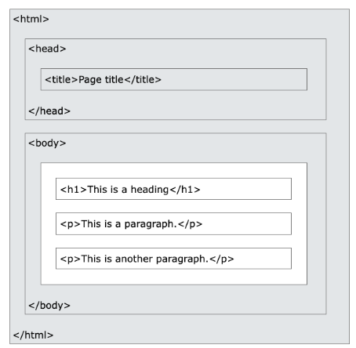
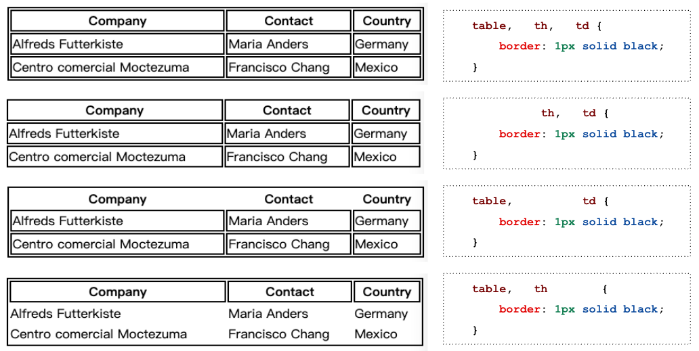
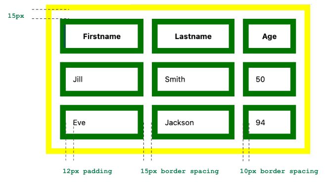
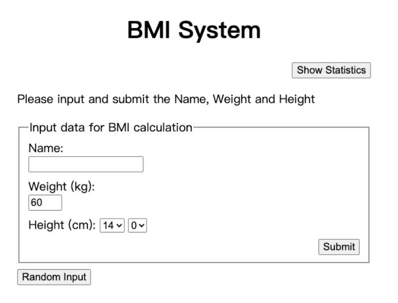

# Ch03 HTML 結構與基礎應用 

本章節將深入探討 HTML 的核心結構、開發工具的使用技巧，以及如何利用各種標記構建功能豐富的網頁。

---

## Slide

[nlh Slide](https://docs.google.com/presentation/d/1W6qQwzzvZQ0OH97TqwBSL6uNfpBtBWPv7fz05woE3z8/edit?usp=sharing)
* Development Tool
* HTML structure
* Basic HTML Tag
* Table
* FORM

[W3School: HTML 教學](https://www.w3schools.com/html/default.asp)


---

## 3.1 開發工具與瀏覽器

常見的 HTML 開發工具包括：

1. **VS Code**：現代開發者最愛的 IDE，特別適合前端開發。
2. **Sublime Text**：輕量級編輯器，適合快速開發。
3. **Atom**：由 GitHub 打造的開發環境，功能強大。

當然，目前許多 AI 開發工具也已經成為開發者不可或缺的工具，例如：

1. **ChatGPT**：用來產生程式碼、回答問題、寫作等。
2. **GitHub Copilot**：直接在 VS Code 中產生程式碼。
3. **Claude**：用來產生程式碼、回答問題、寫作等。

---

### VS Code

*   **智能代碼補全**：內建代碼提示，自動完成標籤與屬性。
*   **擴展性強**：支援多種外掛，涵蓋即時預覽、格式化等。 
*   **輕量化**：資源占用低，開啟速度快。

**必備外掛推薦**
1.  **HTML Snippets**: 提供常用標籤的代碼片段。
2.  **Auto Close Tag**: 輸入 `<div>` 後自動補全 `</div>`。
3.  **Auto Rename Tag**: 修改起始標籤時，自動同步修改結尾標籤。
4.  **Live Server**: 建立本地伺服器，存檔後瀏覽器自動刷新即時預覽。 🚀
5.  **Prettier**: 自動美化縮排與代碼格式。

**高效開發技巧**
*   **Emmet 語法**：
    - `!` 或 `html:5` → 生成標準 HTML5 骨架。
    - `div.container>ul>li*5` → 快速生成嵌套結構。
*   **多光標編輯**：按住 `Alt` (Windows) / `Option` (Mac) 並點擊，可同時編輯多處。
*   **快速導航**：使用 `Ctrl+P` (Windows) / `Cmd+P` (Mac) 快速搜尋並開啟檔案。

**練習 1：建立專案與 HTML 骨架 🧱**
請在專案資料夾下建立一個 `schedule.html` 檔案，並使用 VS Code 的 Emmet 快捷鍵 (`!`) 生成標準 HTML5 骨架。將網頁標題 (`<title>`) 設定為「我的大學課表」。

> [!TIP]
> **延伸學習：VS Code 技巧**
> * 除了 `!`，試試看輸入 `a` 或 `link` 再按 Tab 會出現什麼？
> * 如何在 VS Code 中直接預覽 Markdown 檔案的渲染結果？
> * 到 [W3Schools: HTML Editors](https://www.w3schools.com/html/html_editors.asp) 看看其他開發工具。
> * 打上 lorem, 看看會出現什麼？（虛擬文件） 

### 3.1.2 瀏覽器

常見的瀏覽器有 Chrome、Firefox、Edge、Safari、Opera 等。

目前主流的瀏覽器（稱為 **Evergreen Browsers**）對 HTML5 的支援度都非常高且會自動更新。不同的瀏覽器背後使用不同的**渲染引擎 (Rendering Engine)** 來解析 HTML：

*   **Chromium (Blink)**: 包括 Google Chrome、Microsoft Edge、Opera、Brave 等，目前市場佔有率最高。
*   **WebKit**: 主要是 Apple 的 Safari。所有 iOS 版的瀏覽器（包含 iOS 版 Chrome）都必須使用 WebKit。
*   **Gecko**: 由 Mozilla 開發，主要用於 Firefox。

> [!TIP]
> **如何檢查支援狀況？**
> 雖然現代瀏覽器大多支援基礎 HTML，但某些新特性（如全新的 HTML 標籤或 CSS 屬性）可能在不同瀏覽器的支援度不同。開發者通常會使用 [Can I Use](https://caniuse.com/) 網站來搜尋特定功能的相容性。


### 3.1.3 瀏覽器大戰

網頁開發史上最著名的事件莫過於 90 年代中期的「第一次瀏覽器大戰」：

1.  **Netscape 的崛起 (1994)**：Netscape Navigator 是當時的霸主，市佔率一度超過 90%，並引進了許多現代網頁的核心技術。
2.  **微軟的反擊 (1995)**：微軟推出了 Internet Explorer (IE)，並採取「捆綁銷售」策略（將 IE 與 Windows 系統綁定），讓使用者一開機就有瀏覽器，迅速搶佔市場。
3.  **標準的混亂**：兩家公司為了爭奪主導權，各自推出了不相容的 HTML 標籤（如 Netscape 的 `<blink>` 和 IE 的 `<marquee>`）。這導致開發者必須寫兩套程式碼，也是早期「建議使用 IE / Netscape 開啟」這類提示的起源。
4.  **結果與後續影響**：微軟最终贏得了這場戰爭並壟斷市場多年。Netscape 雖然失敗，但其原始碼後來成為了 **Firefox** 的基礎。這段混亂的歷史也促使了 W3C 致力於制定統一的網頁標準，避免網頁被單一企業壟斷。


---

## 3.2 HTML 基礎結構與常用標記 

:point_right: [Demo: HTML Structure](src/html/demo-structure.html) | [Demo: Text Tags](src/html/demo-text.html) | [Demo: List & Link](src/html/demo-list-link.html) | [Demo: Image Tag](src/html/demo-image.html)



### 3.2.1 HTML5 標準骨架
```html
<!DOCTYPE html>
<html lang="zh-Hant">
<head>
    <meta charset="UTF-8">
    <meta name="viewport" content="width=device-width, initial-scale=1.0">
    <title>我的網頁</title>
</head>
<body>
    <!-- 網頁內容寫在這裡 -->
</body>
</html>
```

### 3.2.2 空元素與非空元素

非空元素 (Non-empty element) 指的是有內容的標籤，例如 `<p>`、`<div>`、`<ul>` 等。注意，非空元素必須有結尾標籤，例如 `<p>...</p>`。

空元素 (Empty element) 指的是沒有內容的標籤，例如 `<br>`、``、`<hr>` 等。注意，空元素不能有結尾標籤。

### 3.2.3 核心文件元素
*   **標題 (`<h1>` - `<h6>`)**：代表權重，`<h1>` 為最高層級（通常一頁一個）。(headline)
*   **段落 (`<p>`)**：用於包裹成段 (paragraph)的文字。
*   **強調 (`<strong>`, `<em>`)**：分別代表「加粗」與「斜體」，語意上表示強調。

**範例：**
```html
<h1>這是主標題</h1>
<h2>這是副標題</h2>
<p>這是一個段落，其中包含 <strong>加粗文字</strong> 以示強調，以及 <em>斜體文字</em> 表示語氣。</p>
```

**Style**
*   **樣式屬性 (`style`)**：在標籤內直接加入 CSS，例如：`<h1 style="color: blue;">`。
*   **CSS 簡介**：CSS 用於美化網頁。雖然本章重點是 HTML，但學會 `style` 屬性可以讓你快速調整顏色、字體與間距。


### 3.2.4 列表與連結
*   **無序列表 (`<ul>` + `<li>`)**：用於點狀條列。
*   **有序列表 (`<ol>` + `<li>`)**：用於數字編號條列。
*   **超連結 (`<a>`)**：使用 `href` 屬性導向目標，`target="_blank"` 可在新分頁開啟。

範例：
```html
<ul>
    <li>無序列表項目 1</li>
    <li>無序列表項目 2</li>
    <li>無序列表項目 3</li>
</ul>

<ol>
    <li>有序列表項目 1</li>
    <li>有序列表項目 2</li>
    <li>有序列表項目 3</li>
</ol>

<a href="https://www.example.com" target="_blank">點擊我</a>
```

### 3.2.5 圖片
*   **圖片 (``)**：必須包含 `src` (來源路徑) 與 `alt` (替代文字，對 SEO 有利)。

範例：
```html

```

結果如下：


> [!Note]
>  是空元素，所以沒有結尾標籤，而且他的 `display` 是 `inline`，所以不會換行。

### 3.2.6 標籤、屬性與內容

```html

<h1 style="color: blue;">逢甲共善樓</h1>
```

* img 是一個元素標籤的`名字`
* src, width, alt 是`屬性`
* 它們的 `value` 分別是 `"img/virtuosi_hall.png"`, `"150px"`, `"示例圖片"`
* h1 的`內容`是「逢甲共善樓」

所以我們在 HTML 文件會看到很多的`標籤`，每個標籤都有`名字`、`屬性`和`內容`。

### 練習 2：加入課表標題與基本資訊
在 `<body>` 中加入以下內容：
1.  使用 `<h1>` 標題顯示「113 學年度第一學期課表」，並用 `style` 將文字顏色改為你喜歡的顏色。
2.  使用 `<h2>` 標題顯示你的姓名與系級。
3.  插入一張你的大頭照或一張與學習相關的圖片 (``)，並用 `style` 設定寬度為 `150px`。
4.  使用一個實用的 **無序列表** (`<ul>`) 列出這學期你最期待的三門課程。

> [!TIP]
> **進階挑戰：語意與結構**
> * 如何在一個列表項目 (`<li>`) 裡面再放入另一個列表？（巢狀列表）
> * 如果想讓連結在新分頁開啟，除了 `target="_blank"`，還有哪些安全性屬性建議加上？
> * 到 [W3Schools: HTML Attributes](https://www.w3schools.com/html/html_attributes.asp) 探索更多標籤屬性。

---

## 3.3 元素的呈現行為與佈局

:point_right: [Demo: Layout & Semantic](src/html/demo-layout.html)

網頁元素的排列方式主要由其顯示屬性（Display）決定。

### 3.3.1 Block vs Inline 概念
1.  **Block (區塊元素)**：
    - 佔滿整行寬度。
    - 前後會自動換行。
    - 可設定寬度 (`width`) 與高度 (`height`)。
    - 範例：`<div>`, `<p>`, `<h1>`, `<ul>`。
2.  **Inline (行內元素)**：
    - 只佔據內容所需的寬度。
    - 不會自動換行，與其他文字併排。
    - 無法設定寬高。
    - 範例：`<span>`, `<a>`, `<strong>`。
3.  **Inline-block**：結合兩者特色，不換行但可設定寬高。
    * 結合了 Block 與 Inline 的特性。
    * 不會從新行開始，可以與其他元素並排。
    * **可以**設定寬高。
    * 常見應用：按鈕 (button)、圖片 (img) 等。
    * see [See more](https://www.w3schools.com/css/css_inline-block.asp)

### 3.3.2 語意化標籤 (Semantic HTML)
為了讓搜尋引擎 (SEO) 與輔助技術更好地理解內容，應使用具備意義的標籤：
*   `<header>`：頁頭（標誌或導航）。
*   `<nav>`：主導航列。
*   `<main>`：主要內容區。
*   `<article>` / `<section>`：獨立文章或主題區塊。
*   `<footer>`：頁尾資訊。


### 3.3.3 版面置中技巧：Margin 的應用
在網頁佈局中，我們常需要將一個「固定寬度」的區塊水平置中於頁面。最簡單的方法就是將左右 `margin` 設定為 `auto`。

**範例：**
```html
<div style="width: 60%; margin-left: auto; margin-right: auto;">
    <p>這是置中的區塊</p>
</div>
```

> [!IMPORTANT]
> 此方法僅適用於 **Block 元素**。如果是內容物（如文字或圖片）要置中，應在父容器設定 `text-align: center;`。

**CSS 範例：**
```css
table {
    border-collapse: collapse;
    width: 100%;
}
th, td {
    border: 1px solid #ddd;
    padding: 12px;
    text-align: left;
}
tr:nth-child(even) {
    background-color: #f9f9f9; /* 斑馬紋 */
}
th {
    background-color: #4CAF50;
    color: white;
}
```

### 練習 3：每週學習目標
在課表下方加入一個 `<div>` 區塊，設定其 CSS 為 `display: block` (預設即是)，並在其中包含：
1.  一個 `<p>` 段落描述你本學期的學習目標。
2.  在段落中對關鍵字使用 `<strong>` 加粗。
3.  加入一個連結 (`<a>`) 到學校的「選課系統」頁面。

> [!TIP]
> **延伸學習：版面配置基礎**
> * 既然 `<div>` 是區塊元素，那有沒有類似但屬於行內元素的標籤？（提示：`<span>`）
> * `<article>` 和 `<section>` 的語意差別在哪裡？什麼時候該用哪一個？
> * 到 [W3Schools: HTML Layout](https://www.w3schools.com/html/html_layout.asp) 學習更多排版觀念。

---

## 3.4 進階組件：表格 (Table)

:point_right: [Demo: Table](src/html/demo-table.html)

表格用於展示結構化數據。

### 3.4.1 基本結構
包含 `<table>`, `<tr>` (行), `<th>` (標題單元格), `<td>` (資料單元格)。

**範例程式碼：**
```html
<table style="border-collapse: collapse; width: 100%;">
  <thead>
    <tr style="background-color: #f2f2f2;">
      <th style="border: 1px solid #ddd; padding: 8px;">姓名</th>
      <th style="border: 1px solid #ddd; padding: 8px;">守備位置</th>
    </tr>
  </thead>
  <tbody>
    <tr>
      <td style="border: 1px solid #ddd; padding: 8px;">大谷翔平</td>
      <td style="border: 1px solid #ddd; padding: 8px;">投手/外野手</td>
    </tr>
  </tbody>
</table>
```

**參數說明：**
*   `border-collapse: collapse;`：將表格邊框合併為單一線條，避免雙線效果。
*   `width: 100%;`：讓表格寬度佔滿父容器。
*   `background-color: #f2f2f2;`：設定背景顏色，常用於區隔標題與內容。
*   `border: 1px solid #ddd;`：設定 `1px` 寬的「實線」邊框，顏色為淺灰色 (`#ddd`)。
*   `padding: 8px;`：設定單元格內部的「留白」，讓文字不會緊貼邊框，提升閱讀舒適度。

Table 中 `border: 1px solid black;` 是一種縮寫，完整的寫法是：
* `border-width: 1px;`
* `border-style: solid;`
* `border-color: black;`



### 3.4.2 樣式美化技巧
利用 CSS 加強可讀性：
*   **合併邊框**：`border-collapse: collapse;`。
*   **斑馬紋效果**：利用 `tr:nth-child(even)` 設置背景色。
*   **內邊距**：增加 `padding` 讓文字不擠迫。

更完整的 Table 介紹，請看 [這裡](https://www.w3schools.com/html/html_tables.asp)。

> [!IMPORTANT]
> **醒目提醒**：雖然表格可以做版面配置，但現代網頁開發應僅將表格用於「展示數據」。佈局（Layout）請使用 CSS 的 Flexbox 或 Grid（後續章節會教）。


```html
   table {
       border: 10px solid yellow;
       border-spacing: 15px;
   }
   th, td {
       border: 10px solid green;
       padding: 12px;
   }
```
以上程式碼中的 `border-spacing: 15px;` 是指表格儲存格之間的距離為 `15px`。



> [!NOTE]
> border-spacing 和 border-collapse 不能同時使用。


### 練習 4：實作課表表格 📅
建立一個表格來呈現週一至週五的課表：
1.  使用 `<table>` 標籤，並設定 `border="1"` (基本邊框) 與 `width="100%"`。
2.  第一行 (`<tr>`) 使用 `<th>` 標示「時段、週一、週二...週五」。
3.  其餘行使用 `<td>` 填入你的課程名稱。如果是空堂，可以填寫「自習」。
4.  **挑戰 1**：嘗試在 `<table>` 標籤加入 `style="margin: 20px auto; width: 80%;"` 讓課表在頁面置中。
5.  **挑戰 2（進階）**：如果某一門課橫跨兩節（例如：3, 4 節都是 Web 程式設計），該如何讓這兩個儲存格合併呈現？（提示：搜尋 `rowspan`）
6.  **挑戰 3（進階）**：在課程名稱旁加上老師的名字，並將老師的名字做成連結，點擊後可連結到老師的個人網頁。

> [!TIP]
> **進階挑戰：表格應用**
> * 如何給表格加上一個置中的標題文字？（提示：`<caption>`）
> * 當單元格內容過多時，如何讓文字自動換行或強制不換行？
> * 到 [W3Schools: HTML Tables](https://www.w3schools.com/html/html_tables.asp) 查看更多儲存格合併範例。

---

## 3.5 進階組件：表單 (Form)

:point_right: [Demo: Form](src/html/demo-form.html)

表單是與使用者互動的最主要途徑。

**基本結構範例：**
```html
<form action="/submit-data" method="POST">
  <fieldset>
    <legend>個人基本資料</legend>
    
    <label for="name">姓名：</label>
    <input type="text" id="name" name="user_name" required><br><br>

    <label for="height">身高 (cm)：</label>
    <input type="number" id="height" name="user_height"><br><br>

    <label for="weight">體重 (kg)：</label>
    <input type="number" id="weight" name="user_weight"><br><br>

    <label>性別：</label>
    <input type="radio" id="male" name="gender" value="male">
    <label for="male">男</label>
    <input type="radio" id="female" name="gender" value="female">
    <label for="female">女</label><br><br>

    <label>興趣：</label>
    <input type="checkbox" id="coding" name="interest" value="coding">
    <label for="coding">寫程式</label>
    <input type="checkbox" id="music" name="interest" value="music">
    <label for="music">音樂</label>
    <input type="checkbox" id="sports" name="interest" value="sports">
    <label for="sports">運動</label><br><br>

    <label for="birthday">生日：</label>
    <input type="date" id="birthday" name="user_birthday"><br><br>
    
    <input type="submit" value="送出報名">
  </fieldset>
</form>
```

> [!TIP]
> **id vs. name：屬性的差別**
> *   **`id`**：這就像是元素的「身份證字號」。它必須在整個網頁中是**唯一**的。通常用於 **CSS 設定樣式** 或 **JavaScript 操作元素**。在表單中，`id` 也可以與 `<label>` 的 `for` 屬性配合，提升點擊的友善度。
> *   **`name`**：這就像是資料的「標籤」。它是傳送到伺服器端的** key (鍵)**。伺服器端會透過 `name` 來取得使用者輸入的資料。如果是單選題 (Radio)，必須給予相同的 `name` 才能達到互斥的效果。

### 3.5.1 `<input>` 的多樣類型

| 類型 | 用途 | 範例 |
| :--- | :--- | :--- |
| `text` / `password` | 文字與密碼 | `<input type="password">` |
| `email` / `url` | 格式驗證 | `<input type="email">` |
| `radio` | 單選題 | 需搭配相同 `name` |
| `checkbox` | 多選題 | 可選取多個項 |
| `date` / `time` | 日期與時間 | 顯示內建挑選器 |

### 3.5.2 下拉選單與多行文字
*   **`<select>`**：建立下拉選單，搭配 `<option>`。
*   **`<textarea>`**：用於輸入長篇訊息，可自訂行數 `rows`。

範例：
```html
<select name="fruit">
    <option value="apple">Apple</option>
    <option value="banana">Banana</option>
    <option value="orange">Orange</option>
</select>
```

### 3.5.3 輸入元素的屬性

以下是 `<input>` 標籤中常見的屬性及其意義：

| 屬性 | 意義 | 範例 |
| :--- | :--- | :--- |
| **`value`** | 設定輸入欄位的**初始值**。 | `<input type="text" value="這是預設文字">` |
| **`readonly`** | 欄位變為**唯讀**。使用者可以看到並選取文字，但無法修改。資料**會**被送出。 | `<input type="text" value="不可修改" readonly>` |
| **`disabled`** | **禁用**元素。元素會呈現灰色，無法點擊或修改，且資料**不會**被送出。 | `<input type="text" disabled>` |
| **`size`** | 設定輸入框在畫面上顯示的**字元寬度** (預設通常為 20)。 | `<input type="text" size="50">` |
| **`maxlength`** | 限制使用者可輸入的內容**最大字元長度**。 | `<input type="text" maxlength="10">` |
| **`min` / `max`** | 設定數值 (`number`)、範圍 (`range`) 或日期 (`date`) 的**最小與最大值**。 | `<input type="number" min="1" max="100">` |
| **`multiple`** | 允許使用者輸入**多個值**。常用於檔案上傳或 Email 列表。 | `<input type="file" multiple>` |
| **`pattern`** | 利用**正規表達式 (Regular Expression)** 進行格式驗證。 | `<input type="text" pattern="[0-9]{3}" title="請輸入三位數字">` |
| **`placeholder`** | 在輸入框中顯示**提示文字**，當使用者開始打字時會消失。 | `<input type="text" placeholder="請輸入姓名">` |
| **`required`** | 標記此欄位為**必填**，若未填寫則瀏覽器會阻止表單送出。 | `<input type="email" required>` |
| **`step`** | 設定數值調整的**間隔（增量）**。 | `<input type="number" step="0.5">` |

**範例代碼：實用的屬性組合**
```html
<!-- 限制長度且必填的文字框 -->
<input type="text" placeholder="請輸入4-8字帳號" maxlength="8" required>

<!-- 固定步長且有範圍限制的數字選取 -->
<input type="number" value="10" min="0" max="100" step="10">
```

### 練習 5：課程調整申請表
在頁面最下方建立一個簡單的表單，模擬「加選/退選申請」：
1.  包含一個 `text` 輸入框填寫「課程名稱」。
2.  使用 `radio` 按鈕讓使用者選擇「加選」或「退選」。
3.  使用 `textarea` 讓使用者輸入「申請理由」。
4.  加入一個「提交申請」的按鈕。

點擊 [這裡](https://www.w3schools.com/html/html_forms.asp) 了解更多表單應用。

> [!TIP]
> **延伸學習：互動與驗證**
> * 除了文字輸入，如何建立一個讓使用者「只能從多個選項中選一個」的下拉選單？
> * 如何在不寫 JavaScript 的情況下，限制使用者輸入的數字必須在 1 到 100 之間？
> * 到 [W3Schools: HTML Form Elements](https://www.w3schools.com/html/html_form_elements.asp) 探索更多表單元件。
---

### 練習 6： BMI 計算表

設計一個表單，如下圖：



要求：
- 置中顯示
- 姓名必填，不可超過 20 個字
- 體重介於 20kg-120kg 之間
- 身高用選的, 140-200cm
- 不使用 <br> 換行 (改用 block)


## 3.6 自我測驗

1. **哪一種標籤最適合用來建立網站的主要導覽列？**
   <details>
   <summary>點擊查看答案</summary>

   答案：`<nav>`

   </details>

2. **如果想要讓連結在新視窗開啟，應該加上什麼屬性？**
   <details>
   <summary>點擊查看答案</summary>

   答案：`target="_blank"`

   </details>

3. **如何讓 `<div>` 標籤在不換行的情況下設定寬高？**
   <details>
   <summary>點擊查看答案</summary>

   答案：將其 CSS 設定為 `display: inline-block;`。

   </details>

4. **在表單中，哪種輸入類型 (type) 適合用於「性別」這種單選題？**
   <details>
   <summary>點擊查看答案</summary>

   答案：`radio` (需要搭配相同的 `name` 屬性)。

   </details>

5. **`<table>` 中用於標示「標題單元格」與「資料單元格」的標籤分別是？**
   <details>
   <summary>點擊查看答案</summary>

   答案：標題為 `<th>`，資料為 `<td>`。

   </details>

---

## 3.7 實作演練

### 基礎結構實作 (文字與連結)
建立一個簡易的個人名片頁：
1. 使用 `<h1>` 標註姓名，`<div>` 作為個人簡介區塊。
2. 插入一張個人照 (``)，並設定寬度。
3. 加入一組連結 (`<a>`)，指向你的 GitHub 或 Facebook。

### 數據結構與佈局 (表格與置中)
建立一個「課程成績表」：
1. 使用 `<table>` 呈現三門課程的名稱、學分與成績。
2. 套用表格美化：包含邊框 (`border`)、內邊距 (`padding`) 與斑馬紋。
3. **挑戰**：將整個表格所在的容器寬度設為 `80%`，並利用 `margin: auto` 使其在頁面水平置中。

### 互動表單設計 (綜合應用)
製作一個「棒球球員入隊報名表」：
1. **個人資訊**：姓名 (text)、Email (email)、年齡 (number)。
2. **專業數據**：守備位置 (select)、打擊習慣 (radio)、最快時速 (range)。
3. **驗證與提交**：
   - 所有個人資訊欄位設為 `required`。
   - 加入照片上傳功能 (`file`)。
   - 加入「我同意隊規」的勾選框 (`checkbox`)。
   - 包含「重設」與「提交」按鈕。

---

> [!NOTE]
> **💡 重點摘要**：HTML 決定了網頁的「結構與內容」，使用語意化標籤與標準屬性，是邁向專業開發者的第一步。