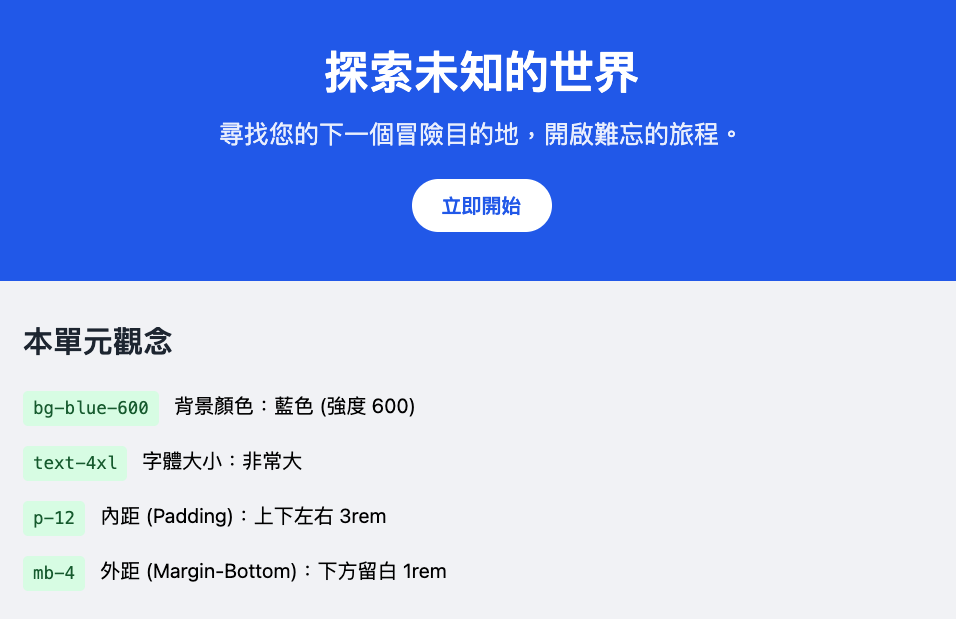
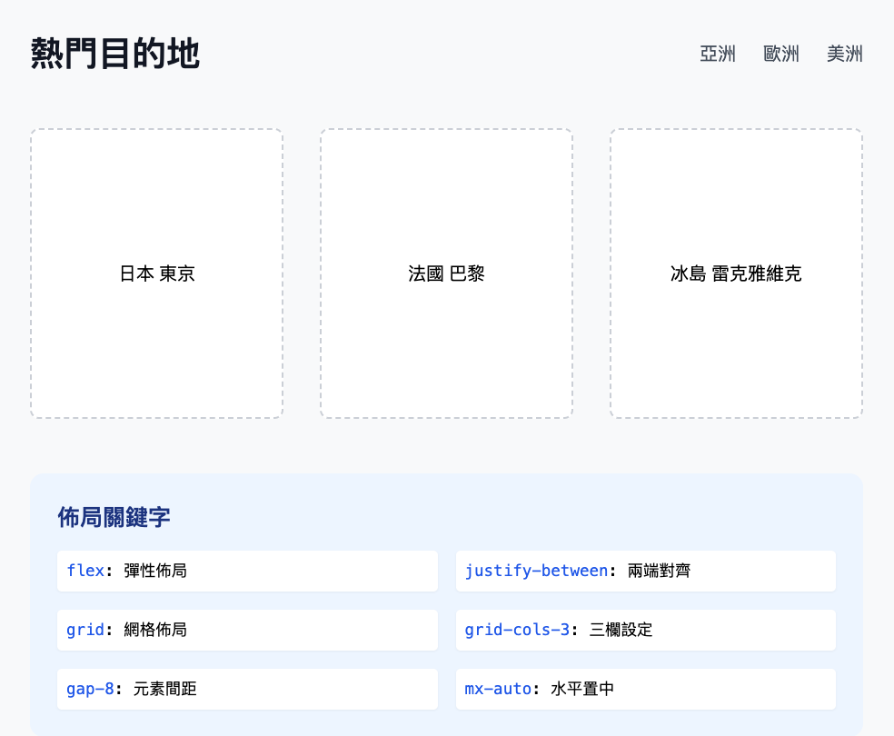
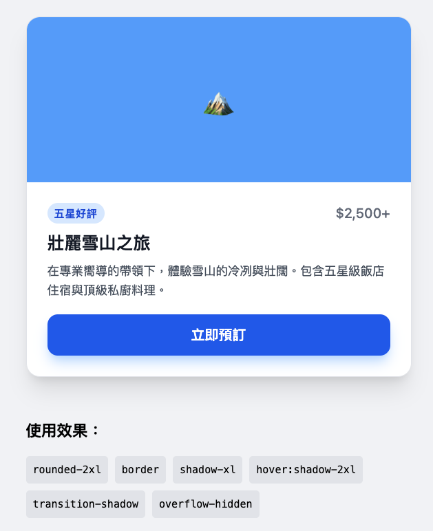
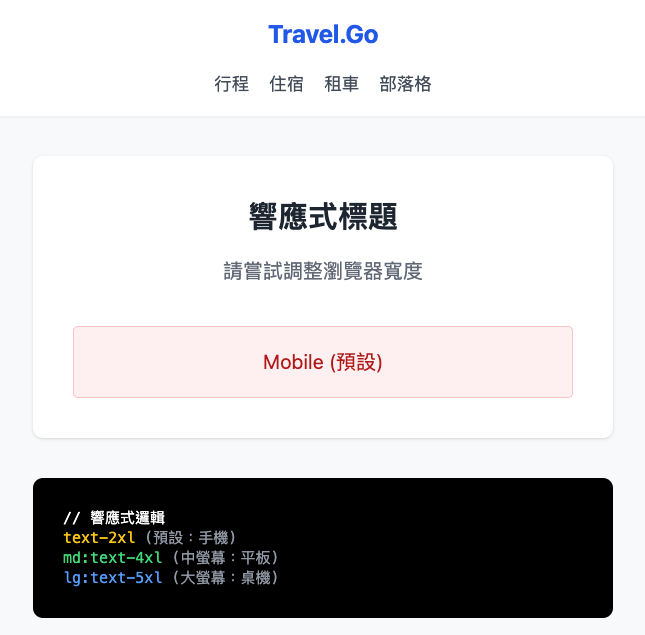
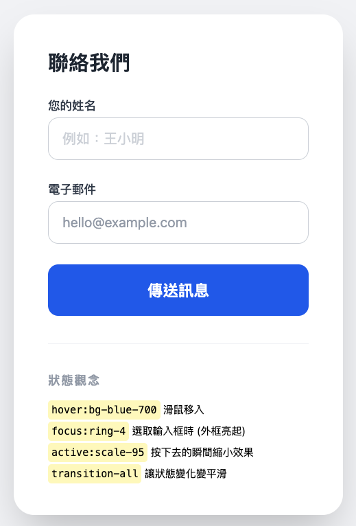

# Tailwind CSS：實用優先的現代網頁設計

在傳統的 Web 開發中，我們習慣撰寫獨立的 CSS 檔案。然而，現代開發趨向於使用 **Tailwind CSS**，一種「實用優先 (Utility-first)」的 CSS 框架。

本章將帶領你透過建立一個「旅遊網站」，手把手掌握 Tailwind CSS 的核心觀念。

---

## 1. 基礎觀念：顏色、文字與間距

Tailwind 的核心是將 CSS 屬性映射到簡短的 Class 名稱。

### 核心觀念
-   **顏色 (Colors)**：`bg-{color}-{level}` (背景), `text-{color}-{level}` (文字)。
-   **字體 (Typography)**：`text-{size}` (大小), `font-{weight}` (粗細)。
-   **間距 (Spacing)**：`p-{size}` (Padding), `m-{size}` (Margin)。

### 📋 實測與範例
請查看範例檔：[demo_basics.html](./src/tailwind/demo_basics.html)



#### 📝 代碼片段講解
```html
<section class="bg-blue-600 text-white p-12 text-center">
    <h1 class="text-4xl font-bold mb-4">探索未知的世界</h1>
    <a href="#" class="bg-white text-blue-600 px-6 py-3 rounded-full font-semibold hover:bg-blue-50 transition">
        立即開始
    </a>
</section>
```
- `bg-blue-600`: 設定背景顏色為藍色，數字 600 代表色深。
- `p-12`: 設定內距 (Padding) 為 3rem (12 * 0.25rem)。
- `text-center`: 讓文字水平置中。
- `rounded-full`: 將按鈕設定為完全圓角。

### 💡 觀念測驗
1. 如何設定文字為紅色且加粗？
<details>
<summary>點擊查看答案</summary>
使用 `text-red-500 font-bold` (level 可調整)。
</details>

2. `p-4` 和 `m-4` 的差別是什麼？
<details>
<summary>點擊查看答案</summary>
`p-4` 是內距 (Padding)，`m-4` 是外距 (Margin)。
</details>

---

## 2. 佈局與排版：Flexbox 與 Grid

旅遊網站需要展示「熱門目的地」，這時佈局 Class 就派上用場了。

### 核心觀念
-   **Flexbox**：`flex`, `flex-row`, `items-center`, `justify-between`。
-   **Grid**：`grid`, `grid-cols-{n}`, `gap-{n}`。
-   **容器置中**：`container mx-auto`。

### 📋 實測與範例
請查看範例檔：[demo_layout.html](src/tailwind/demo_layout.html)



#### 📝 代碼片段講解
```html
<div class="grid grid-cols-1 md:grid-cols-3 gap-8">
    <div class="bg-white h-64 border-2 rounded-lg">日本 東京</div>
    <div class="bg-white h-64 border-2 rounded-lg">法國 巴黎</div>
    <div class="bg-white h-64 border-2 rounded-lg">冰島 雷克雅維克</div>
</div>
```
- `grid`: 啟動網格佈局系統。
- `grid-cols-3`: 將容器水平切分為三等份。
- `gap-8`: 子元素之間的間距設定為 2rem。
- `md:grid-cols-3`: 這是響應式語法，代表中型螢幕 (md) 以上才顯示三欄。

### 💡 觀念測驗
1. `grid-cols-3` 的作用是什麼？
<details>
<summary>點擊查看答案</summary>
將網格佈局設定為三等份的欄位。
</details>

2. 如何讓一個元素在父容器中水平居中？
<details>
<summary>點擊查看答案</summary>
使用 `mx-auto` (通常需要配合 `block` 或寬度設定)。
</details>

---

## 3. 視覺精修：邊框、圓角與陰影

要讓你的旅遊卡片看起來「很高級」，需要加入深度的視覺效果。

### 核心觀念
-   **圓角 (Border Radius)**：`rounded`, `rounded-lg`, `rounded-full`。
-   **陰影 (Box Shadow)**：`shadow-sm`, `shadow-md`, `shadow-xl`。
-   **邊框 (Borders)**：`border`, `border-2`, `border-gray-200`。

### 📋 實測與範例
請查看範例檔：[demo_effects.html](src/tailwind/demo_effects.html)



#### 📝 代碼片段講解
```html
<div class="bg-white rounded-2xl border border-gray-200 overflow-hidden shadow-xl hover:shadow-2xl transition-shadow">
    <div class="bg-blue-400 h-48 flex items-center justify-center">...</div>
    <div class="p-6">...</div>
</div>
```
- `rounded-2xl`: 設定較大的圓角。
- `shadow-xl`: 設定較明顯的投影效果。
- `hover:shadow-2xl`: 當滑鼠懸停時，陰影變大。
- `transition-shadow`: 讓陰影變化時有平滑的動畫效果。

### 💡 觀念測驗
1. 想製作一個圓形的按鈕，應該用哪個 Class？
<details>
<summary>點擊查看答案</summary>
`rounded-full`。
</details>

---

## 4. 響應式設計 (Responsive Design)

現代網頁必須在手機、平板與桌面都有良好表現。Tailwind 採用 **Mobile First** (手機優先) 策略。

### 核心觀念
-   **斷點 (Breakpoints)**：
    -   `sm:` (640px)
    -   `md:` (768px)
    -   `lg:` (1024px)
-   **範例**：`w-full md:w-1/2` (手機滿版，平板一半)。

### 📋 實測與範例
請查看範例檔：[demo_responsive.html](src/tailwind/demo_responsive.html)



#### 📝 代碼片段講解
```html
<h1 class="text-2xl md:text-4xl lg:text-5xl font-black">
    響應式標題
</h1>
```
- `text-2xl`: 預設 (手機端) 的字體大小。
- `md:text-4xl`: 在 768px 以上的螢幕，字體放大。
- `lg:text-5xl`: 在 1024px 以上的螢幕，字體再次放大。

---

## 5. 互動與狀態 (States & Transitions)

讓按鈕點起來有反應，表單選取時發光。

### 核心觀念
-   **互動修飾符**：`hover:`, `focus:`, `active:`。
-   **動畫過渡**：`transition`, `duration-300`。

### 📋 實測與範例
請查看範例檔：[demo_states.html](src/tailwind/demo_states.html)



#### 📝 代碼片段講解
```html
<button class="bg-blue-600 hover:bg-blue-700 active:scale-95 transition-all">
    傳送訊息
</button>
```
- `hover:bg-blue-700`: 滑鼠移入時加深顏色。
- `active:scale-95`: 按下去的瞬間，按鈕縮小成 95%，產生物理點擊感。
- `transition-all`: 讓所有屬性變化（如顏色底色、比例）都有過渡動畫。

---

## 🛠️ 綜合練習：打造你的旅遊首頁

請在練習中組合以上觀念，實作以下功能：
1. 一個帶有背景色的 **Navigation Bar**。
2. 一個具有陰影與圓角的 **目的地卡片 (Destination Card)**。
3. 卡片在滑鼠懸停 (hover) 時，陰影要加深。
4. 在手機上顯示 1 欄卡片，桌機上顯示 3 欄。

> [!TIP]
> **💡 重點觀念**：Tailwind 的強大在於你「不需要離開 HTML」就能完成設計。這在進行 Django 或 HTMX 開發時，能極大地提升效率。
