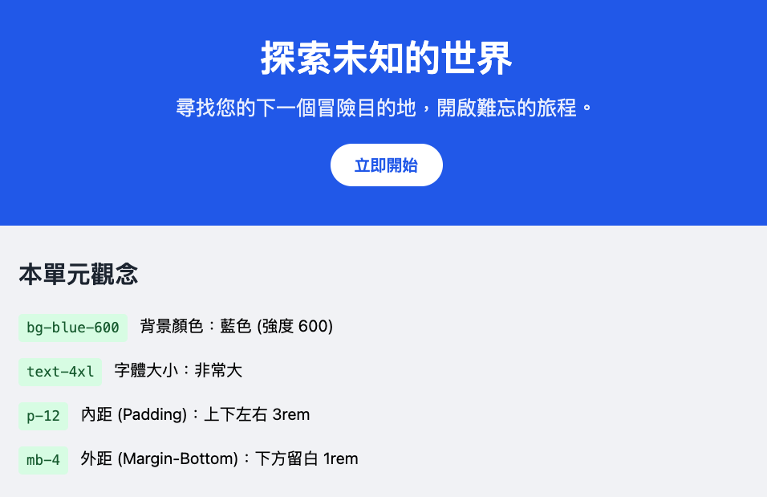
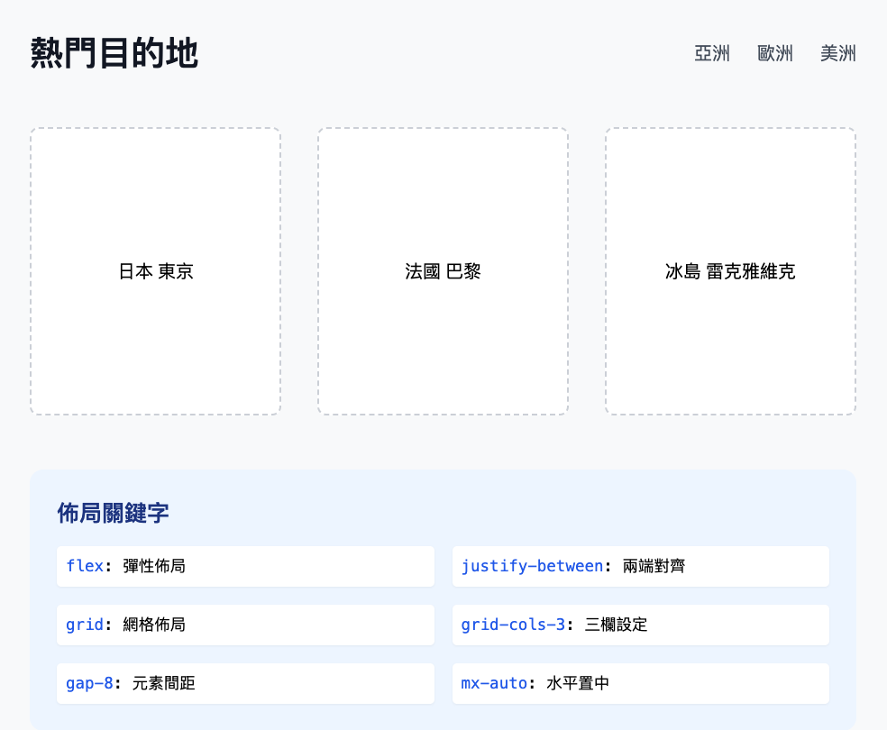
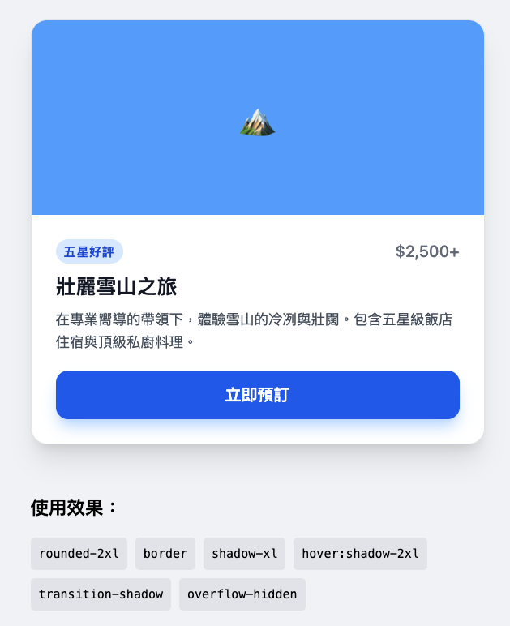
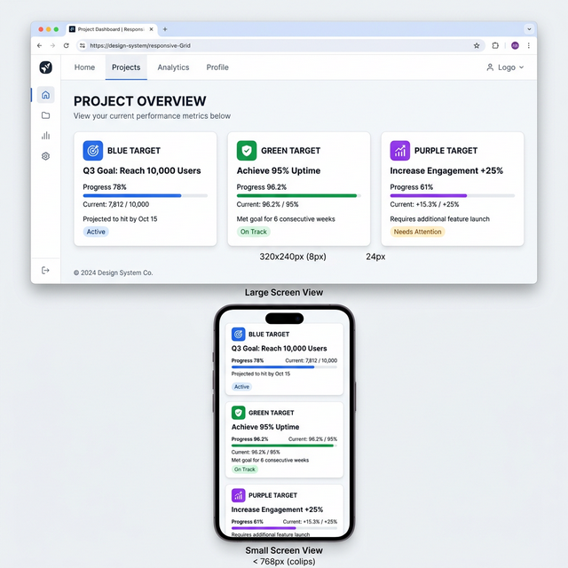
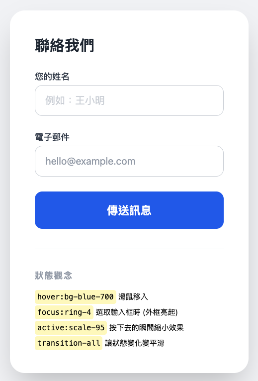
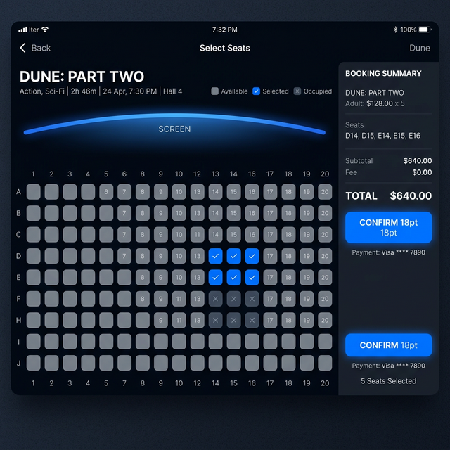

# Ch06 Tailwind CSS：實用優先的現代網頁設計

> **「Tailwind 的簡寫不只是為了偷懶，它是透過『編譯技術』換取了『極小的體積』，並透過『規範命名』換取了『系統的一致性』。」**

## 6.1 為何選擇 Tailwind CSS？

在傳統的 Web 開發中，我們習慣撰寫獨立的 CSS 檔案，為每個元件命名一個 class（如 `.card-title`、`.nav-link`），再在 CSS 裡定義它的樣式。這種方式靈活，但隨著專案成長，會面臨幾個常見痛點：

- 樣式表越來越大，難以維護
- 命名越來越難（`.card-title-2-red-big`？）
- 不同人寫出的 CSS 風格不一致

Tailwind CSS 提出了一種截然不同的哲學——**實用優先 (Utility-First)**：不定義語意化的 class，而是直接把 CSS 屬性封裝成極短的工具類別，直接寫在 HTML 裡。

### 6.1.1 優勢一：透過「編譯技術」換取「極小的體積」

傳統 CSS 框架（如 Bootstrap）會把所有元件的樣式全部打包，檔案可能高達數百 KB。而 Tailwind 在**生產環境**時會啟動「Tree-Shaking (搖樹優化)」，透過靜態分析掃描你的 HTML/JS，**只保留你真正用到的 class**，移除未使用的樣式。

這意味著一個大型網站最終的 CSS 檔案，往往只有幾 KB 甚至幾十 KB，比傳統方式小 10-100 倍。

```
傳統框架：載入所有樣式 → 使用者下載大量無用 CSS
Tailwind：掃描使用的 class → 只打包需要的樣式 → 極小的 CSS 體積
```

> [!NOTE]
> 在學習階段，我們透過 CDN `<script src="https://cdn.tailwindcss.com">` 引入，這會在瀏覽器端動態生成所有樣式。正式部署時才使用 CLI 工具進行編譯與 Tree-Shaking。

### 6.1.2 優勢二：透過「規範命名」換取「系統的一致性」

Tailwind 的所有 class 都遵循嚴格的命名規則：

| 格式 | 範例 | 含義 |
|------|------|------|
| `{屬性}-{數值}` | `p-4`, `m-8` | padding/margin 使用間距比例 |
| `{屬性}-{顏色}-{色階}` | `bg-blue-500`, `text-red-200` | 使用統一色板 |
| `{響應式前綴}:{class}` | `md:flex`, `lg:text-xl` | 響應式設計 |
| `{狀態前綴}:{class}` | `hover:bg-blue-600`, `focus:ring` | 互動狀態 |

這套命名體系讓整個團隊之間共享一個**設計語言**：不同開發者看到 `text-gray-700` 就知道是深灰色文字，看到 `p-4` 就知道是 16px 內距，大幅減少溝通與設計不一致的問題。

### 6.1.3 Tailwind v.s. 傳統 CSS

| | 傳統 CSS | Tailwind CSS |
|---|---|---|
| **撰寫方式** | .class { ... } | HTML class 直接套用 |
| **命名負擔** | 高（需為每個元件命名） | 無（使用標準化工具類別） |
| **檔案大小** | 隨專案增長 | 生產環境極小（Tree-Shaking）|
| **一致性** | 依賴開發者自律 | 框架強制系統規範 |
| **學習曲線** | 低（你已懂 CSS）| 中（需熟悉 class 命名）|

本章將帶領你透過建立一個「旅遊網站」，手把手掌握 Tailwind CSS 的核心觀念。

---


## 6.2 基礎觀念：顏色、文字與間距

Tailwind 的核心是將 CSS 屬性映射到簡短的 Class 名稱。這不僅減少了命名困難，更建立了一套和諧的設計系統。

### 6.2.1 核心觀念
-   **顏色系統 (Color Palette)**：
    - 格式：`{property}-{color}-{level}`。例如 `bg-blue-500`。
    - 色階從 `50` (最淺) 到 `950` (最深)。通常 `500` 是主要色，`600` 以上適合文字，`50` 適合背景。
    - **任意值支援**：如果預設顏色不夠，可用 `bg-[#1da1f2]` 這種語法直接套用色碼。
-   **字體與排版 (Typography)**：
    - 大小：`text-xs` (12px) 到 `text-9xl` (128px)。
    - 粗細：`font-light`, `font-normal`, `font-bold`, `font-black`。
    - 行高與間距：`leading-tight` (行高), `tracking-wider` (字距)。
-   **間距系統 (Spacing)**：
    - `p-` (Padding), `m-` (Margin)。
    - 數字單位：`1` 代表 `0.25rem` (4px)。所以 `p-4` = 16px。
    - 定向間距：`pt-` (top), `px-` (水平), `py-` (垂直)。

### 6.2.2 實測與範例
請查看範例檔：[demo_basics.html](https://nlhsueh.github.io/web2026/viewer.html?file=tailwind/demo_basics.html)



#### 📝 程式碼片段講解
```html
<section class="bg-blue-600 text-white p-12 text-center">
    <h1 class="text-4xl font-extrabold mb-4 tracking-tight">探索未知的世界</h1>
    <p class="text-blue-100 mb-8 max-w-md mx-auto">
        準備好開啟一段奇妙的旅程了嗎？我們為你精選了全球最值得造訪的秘境。
    </p>
    <a href="#" class="bg-white text-blue-600 px-8 py-3 rounded-full font-bold hover:bg-blue-50 transition-all shadow-lg active:scale-95">
        立即開始
    </a>
</section>
```
- `font-extrabold` 比 `font-bold` 更具視覺衝擊力，適合 Hero Section 的大標題。
- `text-blue-100` 利用色階讓副標題與主標題產生層次感，而不是單調的純白。
- `max-w-md mx-auto` 限制文字寬度並置中，是處理長段落排版的必備技巧。

1. 如何使用 Tailwind 指定一個精密的背景顏色 `#ff5733`？
    > <details>
    > <summary>按此查看答案與解析</summary>
    >
    > **答案：使用任意值語法 `bg-[#ff5733]`**  
    > 解析：Tailwind 的任意值語法允許你直接在方括號內填入自定義數值或色碼。
    > </details>

2. `px-4 py-2` 代表的實際像素是多少？（假設預設 1 個單位 = 4px）
    > <details>
    > <summary>按此查看答案與解析</summary>
    >
    > **答案：16px 水平內距，8px 垂直內距**  
    > 解析：`px-4` = 4 × 4px = 16px，`py-2` = 2 × 4px = 8px。
    > </details>

3. 下列哪一組 Tailwind class 能讓文字顯示為**深藍色且字體加粗**？
* 🇦 `color-blue-800 weight-bold`
* 🇧 `text-blue-800 font-bold`
* 🇨 `fg-blue-800 text-bold`
* 🇩 `blue-800 bold`

    > <details>
    > <summary>按此查看答案與解析</summary>
    >
    > **答案：🇧**  
    > 解析：Tailwind 的文字顏色屬性前綴為 `text-`，字重屬性前綴為 `font-`。
    > </details>

4. 在 Tailwind 的間距系統中，`m-8` 代表多少像素的外距？（假設預設 1 單位 = 4px）
* 🇦 8px
* 🇧 16px
* 🇨 32px
* 🇩 64px

    > <details>
    > <summary>按此查看答案與解析</summary>
    >
    > **答案：🇨**  
    > 解析：`m-8` = 8 × 4px = 32px。
    > </details>

### 6.2.4 動手做：Lab 6.2 旅遊網站標題修改
**目標**：修改 [demo_basics.html](https://nlhsueh.github.io/web2026/viewer.html?file=tailwind/demo_basics.html)，將主視覺改為「祖母綠」的森林主題。
- 將背景改為 `bg-emerald-600`，文字改為 `text-emerald-50`。
- 將按鈕改為 `rounded-full` (完全圓角)，字體變色為 `text-emerald-700`。
- 觀察不同的 padding (`p-12` 改為 `p-16`) 對排版的影響。
- **解答參考**：👉 [lab6_2.html](https://nlhsueh.github.io/web2026/viewer.html?file=tailwind/lab6_2.html)

---

## 6.3 佈局與排版：Flexbox 與 Grid

Tailwind 讓佈局變得極其直覺，通常透過最外層容器的 Class 就能決定內部的排列方式。

### 6.3.1 核心觀念
-   **Flexbox (一維排版)**：
    - `flex`: 啟動 Flex 模式。
    - `items-center`: 垂直居中；`justify-between`: 兩端對齊。
    - `flex-grow`: 讓特定元件佔滿剩餘空間。
-   **Grid (二維排版)**：
    - `grid`: 啟動 Grid 模式。
    - `grid-cols-{n}`: 定義欄數 (1~12)。
    - `gap-{n}`: 子元素間距。
    - `col-span-{n}`: 讓單一子元素跨越多欄。
-   **容器與居中**：
    - `container mx-auto`: 建立一個限寬且水平居中的區塊，這在寬螢幕顯示上非常重要。

### 6.3.2 實測與範例
請查看範例檔：[demo_layout.html](https://nlhsueh.github.io/web2026/viewer.html?file=tailwind/demo_layout.html)



#### 📝 程式碼片段講解
```html
<div class="grid grid-cols-1 md:grid-cols-3 gap-8 container mx-auto px-4">
    <div class="bg-white p-6 border rounded-xl shadow-sm">
        <h3 class="font-bold underline">日本 東京</h3>
        <p class="text-gray-500 text-sm">現代與傳統的完美融合</p>
    </div>
    <div class="bg-white p-6 border rounded-xl shadow-sm md:col-span-2">
        <h3 class="font-bold underline">精選活動</h3>
        <p class="text-gray-500 text-sm">由於此區塊用了 md:col-span-2，它在中型螢幕會佔據兩倍寬度。</p>
    </div>
</div>
```
- `grid-cols-1`: 手機端預設為單欄，避免內容太擠。
- `md:grid-cols-3`: 桌機端自動轉為三欄。
- `col-span-2`: 透過跨欄設定，可以創造出「主從關係」的佈局視覺。

1. `items-center` 和 `justify-center` 在 Flex 容器中的差別？
    > <details>
    > <summary>按此查看答案與解析</summary>
    >
    > **答案：`items-center` 是垂直軸（交錯軸）居中，`justify-center` 是水平軸（主軸）居中**  
    > 解析：這兩者控制不同維度的對齊。
    > </details>

2. 想在 Grid 中設定各元素間距為 20px，應該用哪個 Class？
    > <details>
    > <summary>按此查看答案與解析</summary>
    >
    > **答案：`gap-5`**  
    > 解析：5 × 4px = 20px。
    > </details>

3. 下列哪一組設定可以讓某個子元素在 3 欄網格中**跨越 2 欄**？
* 🇦 `grid-cols-2`
* 🇧 `col-span-2`
* 🇨 `span-cols-2`
* 🇩 `col-2`

    > <details>
    > <summary>按此查看答案與解析</summary>
    >
    > **答案：🇧**  
    > 解析：`col-span-{n}` 用於定義子元素橫跨的欄位數量。
    > </details>

4. 在 Tailwind 的 Flexbox 中，`flex-col` 的效果等同於原生 CSS 的哪個屬性值？
* 🇦 `flex-direction: row`
* 🇧 `flex-wrap: wrap`
* 🇨 `flex-direction: column`
* 🇩 `align-items: flex-start`

    > <details>
    > <summary>按此查看答案與解析</summary>
    >
    > **答案：🇨**  
    > 解析：`flex-col` 即 `flex-direction: column`，使項目垂直排列。
    > </details>

### 6.3.4 動手做：Lab 6.3 調整旅遊網站佈局
**目標**：修改 [demo_layout.html](https://nlhsueh.github.io/web2026/viewer.html?file=tailwind/demo_layout.html)，將三欄式佈局改為四欄式。
- 將網格設定改為 `md:grid-cols-4`。
- 將原本的間距 `gap-8` 加大為 `gap-10`。
- 新增第四張目的地卡片（例如：美國 紐約）。
- **解答參考**：👉 [lab6_3.html](https://nlhsueh.github.io/web2026/viewer.html?file=tailwind/lab6_3.html)

---

## 6.4 視覺精修：邊框、圓角與陰影

細節決定質感。Tailwind 提供的視覺修飾工具可以讓你輕鬆做出「現代感」介面。

### 6.4.1 核心觀念
-   **圓角 (Rounded)**：`rounded-...` 從 `sm` 到 `3xl` 和 `full`。建議卡片使用 `rounded-xl` 以上。
-   **陰影 (Shadow)**：`shadow-...` 營造深度感。`shadow-xl` 適合浮動卡片。
-   **光環與邊框 (Ring & Border)**：
    - `border-2`: 粗細。
    - `ring-2 ring-blue-500/50`: 建立一個帶有透明度的外圈，這在製作選中狀態時非常美觀。
-   **圖片比例 (Aspect Ratio)**：`aspect-video`, `aspect-square`。

### 6.4.2 實測與範例
請查看範例檔：[demo_effects.html](https://nlhsueh.github.io/web2026/viewer.html?file=tailwind/demo_effects.html)



#### 📝 程式碼片段講解
```html
<div class="bg-white rounded-3xl overflow-hidden shadow-2xl ring-1 ring-black/5 hover:ring-blue-500/50 transition-all duration-500">
    <div class="aspect-video bg-slate-200">
        
    </div>
    <div class="p-8">
        <span class="inline-block bg-green-100 text-green-700 font-bold px-3 py-1 rounded text-xs mb-3">特價中</span>
        <h4 class="text-xl font-bold">地中海巡航</h4>
    </div>
</div>
```
- `rounded-3xl` + `overflow-hidden`: 確保內部圖片不會超出卡片的超大圓角。
- `shadow-2xl`: 營造強烈的立體感。
- `ring-black/5`: 這是現在非常流行的 UI 技巧，使用極淡的黑色 Ring 取代實體邊框，看起來更輕盈。
- `object-cover`: 確保圖片在固定比例的容器中不會變形。

1. 如何讓圖片永遠保持 16:9 比例？
    > <details>
    > <summary>按此查看答案與解析</summary>
    >
    > **答案：使用 `aspect-video`**  
    > 解析：Tailwind 的 `aspect-ratio` 工具類別可以輕鬆維持元素的長寬比。
    > </details>

2. 如何在滑鼠移入時讓陰影變大？
    > <details>
    > <summary>按此查看答案與解析</summary>
    >
    > **答案：使用 `hover:shadow-2xl`**  
    > 解析：結合狀態修飾符 `hover:` 與陰影工具類別。
    > </details>

3. 下列哪個 Tailwind class 可以讓一張矩形圖片顯示為**完全圓形**？
* 🇦 `rounded-xl`
* 🇧 `rounded-3xl`
* 🇨 `rounded-full`
* 🇩 `border-radius-circle`

    > <details>
    > <summary>按此查看答案與解析</summary>
    >
    > **答案：🇨**  
    > 解析：`rounded-full` 會套用極大的圓角，在正方形元素上即呈現圓形。
    > </details>

4. 在 Tailwind 中，`ring-2 ring-blue-500/50` 的 `/50` 代表什麼？
* 🇦 邊框寬度為 50px
* 🇧 藍色的色階為 50
* 🇨 顏色的透明度為 50%
* 🇩 元素的尺寸縮放為 50%

    > <details>
    > <summary>按此查看答案與解析</summary>
    >
    > **答案：🇨**  
    > 解析：斜線後方的數字代表色彩的透明度值（Opacity）。
    > </details>

### 6.4.4 動手做：Lab 6.4 卡片視覺優化
**目標**：修改 [demo_effects.html](https://nlhsueh.github.io/web2026/viewer.html?file=tailwind/demo_effects.html)，讓卡片更精緻且具備互動感。
- 將卡片圓角改為更大的 `rounded-3xl`。
- 滑鼠移入時，除了陰影效果，加入 `hover:ring-4 hover:ring-blue-300/50` 讓邊框發光。
- （進階）加上 `hover:-translate-y-2` 讓卡片移入時會有往上浮動的效果。
- **解答參考**：👉 [lab6_4.html](https://nlhsueh.github.io/web2026/viewer.html?file=tailwind/lab6_4.html)

---

## 6.5 響應式設計 (Responsive Design)

現代網頁必須在手機、平板與桌面都有良好表現。Tailwind 採用 **Mobile First** (手機優先) 策略，這意味著不帶斷點前綴的 Class 會套用在所有螢幕，而 `md:` 等前綴則是「覆蓋」預設值。

### 核心觀念
-   **斷點標準 (Breakpoints)**：
    | 前綴 | 最小寬度 | 對應裝置 |
    | :--- | :--- | :--- |
    | `(無)` | 0px | 手機 (預設) |
    | `sm:` | 640px | 大手機 / 平板直向 |
    | `md:` | 768px | 平板橫向 |
    | `lg:` | 1024px | 筆電 / 電腦 |
    | `xl:` | 1280px | 大型螢幕 |

-   **常見模式**：
    - `w-full md:w-1/2`: 手機滿版，桌面端一半。
    - `hidden md:block`: 在行動端隱藏次要元件（如側邊欄），桌面端顯示。

### 6.5.2 實測與範例
1. **元素隱藏 (Hiding)**：練習在小螢幕時隱藏次要資訊。
   👉 [demo_responsive.html](https://nlhsueh.github.io/web2026/viewer.html?file=tailwind/demo_responsive.html)
2. **元件堆疊 (Stacking)**：練習在小螢幕時讓元件自動往下擠。
   👉 [demo_stacking.html](https://nlhsueh.github.io/web2026/viewer.html?file=tailwind/demo_stacking.html)



#### 📝 程式碼片段講解 (響應式文字與佈局)
```html
<div class="p-4 md:p-10 flex flex-col md:flex-row items-center">
    <div class="w-full md:w-1/3 mb-4 md:mb-0">
        
    </div>
    <div class="w-full md:w-2/3 md:pl-8">
        <h2 class="text-xl md:text-3xl font-black">響應式標題</h2>
        <p class="text-sm md:text-base mt-2 text-gray-600">文字大小隨螢幕調整</p>
    </div>
</div>
```
- `flex-col md:flex-row`: 在手機端垂直堆疊，在平板以上水平排列。這是一切響應式佈局的起點。
- `mb-4 md:mb-0`: 手機端需要下邊距來隔開垂直堆疊的內容，但轉為水平排列後應取消邊距。

#### 📝 程式碼片段講解 (堆疊邏輯)
```html
<div class="grid grid-cols-1 md:grid-cols-2 lg:grid-cols-3 gap-6">
    <!-- 當橫向空間不足時，元件會自動換行 -->
    <div>卡片 1</div>
    <div>卡片 2</div>
    <div>卡片 3</div>
</div>
```
- `grid-cols-1`: 手機端預設為單欄（自動堆疊）。
- `md:grid-cols-2`: 中型螢幕顯示兩欄。
- `lg:grid-cols-3`: 大型螢幕顯示三欄。

1. 在 Tailwind 的 Mobile First 設計中，`hidden md:block` 代表什麼行為？
* 🇦 在所有裝置上都隱藏
* 🇧 只在手機上顯示，平板以上隱藏
* 🇨 在手機上隱藏，螢幕達 768px 以上才顯示
* 🇩 在桌機上隱藏，手機上顯示

    > <details>
    > <summary>按此查看答案與解析</summary>
    >
    > **答案：🇨**  
    > 解析：預設為 `hidden`（隱藏），但當螢幕寬度達到 `md` 中型斷點時切換為 `block`（顯示）。
    > </details>

2. 以下哪一組 Tailwind class 能讓 Grid 佈局實現「手機 1 欄、平板 2 欄、桌機 4 欄」？
* 🇦 `grid-cols-1 md:grid-cols-2 lg:grid-cols-4`
* 🇧 `grid-1 tablet:grid-2 desktop:grid-4`
* 🇨 `cols-1 cols-md-2 cols-lg-4`
* 🇩 `grid grid-cols-4 sm:grid-cols-2 xs:grid-cols-1`

    > <details>
    > <summary>按此查看答案與解析</summary>
    >
    > **答案：🇦**  
    > 解析：這是最標準的 Mobile First 寫法，從小到大依次覆蓋。
    > </details>

### 6.5.4 動手做：Lab 6.5 響應式導覽列
**目標**：修改 [demo_responsive.html](https://nlhsueh.github.io/web2026/viewer.html?file=tailwind/demo_responsive.html)，讓右上角的選單只在桌面端顯示。
- 在包含連結的 `<ul>` 選單加上 `hidden md:flex`，代表在手機版隱藏，在 md 尺寸以上才轉為 flex 佈局顯示。
- 嘗試加入一個代表「漢堡選單」的按鈕，並加上 `block md:hidden` 設定，讓它只在手機板才會出現。
- **解答參考**：👉 [lab6_5.html](https://nlhsueh.github.io/web2026/viewer.html?file=tailwind/lab6_5.html)

---

## 6.6 互動與狀態 (States & Transitions)

Tailwind 讓動態效果變得像靜態排版一樣簡單，透過「修飾符」來定義不同狀態下的樣子。

### 核心觀念
-   **常用修飾符**：
    - `hover:`: 滑鼠懸停。
    - `focus:`: 輸入框選中。
    - `active:`: 正在點擊。
    - `group-hover:`: 讓父元素懸停時，子元素跟著變色（這對導覽列或卡片非常實用）。
-   **動畫過渡 (Transitions)**：
    - `transition-all`: 啟動過渡效果。
    - `duration-300`: 設定毫秒數。
    - `ease-in-out`: 設定運動曲線。

### 📋 實測與範例
請查看範例檔：[demo_states.html](https://nlhsueh.github.io/web2026/viewer.html?file=tailwind/demo_states.html)



#### 📝 程式碼片段講解
```html
<div class="group bg-white p-6 rounded-xl hover:bg-slate-900 transition-colors duration-500">
    <h3 class="text-black group-hover:text-white transition-colors">卡片標題</h3>
    <p class="text-gray-500 group-hover:text-gray-300">懸停父元素，內容會跟著變色</p>
</div>
```
- `group`: 將容器標記為一組。
- `group-hover:text-white`: 當父容器被 hover 時，標題會變白。這是製作互動卡片的標準做法。

1. 若要讓「滑鼠懸停於父元素時，子元素的文字顏色改變」，應該在父元素加上哪個 class？
* 🇦 `hover-group`
* 🇧 `parent`
* 🇨 `group`
* 🇩 `hover:children`

    > <details>
    > <summary>按此查看答案與解析</summary>
    >
    > **答案：🇨**  
    > 解析：在父元素加上 `group`，子元素即可使用 `group-hover:` 修飾符來達成聯動效果。
    > </details>

2. 以下哪一組 class 可以讓按鈕在點擊（active）時輕微縮小，並有平滑過渡效果？
* 🇦 `click:scale-95 smooth`
* 🇧 `active:scale-95 transition-transform`
* 🇨 `pressed:scale-95 animation-smooth`
* 🇩 `active:shrink transition`

    > <details>
    > <summary>按此查看答案與解析</summary>
    >
    > **答案：🇧**  
    > 解析：`active:` 修飾符對應點擊狀態，`transition-transform` 確保動作平滑。
    > </details>

### 6.6.4 動手做：Lab 6.6 按鈕 Group Hover 效果
**目標**：修改 [demo_states.html](https://nlhsueh.github.io/web2026/viewer.html?file=tailwind/demo_states.html) 的按鈕，當 hover 按鈕整體時，裡面的圖示會產生位移。
- 將 `<button>` 加上 `group` class 以包裹整個按鈕。
- 在按鈕內加入一個 SVG 箭頭圖示 `<svg>...</svg>`。
- 為箭頭圖示加上 `group-hover:translate-x-2` 與 `transition-transform`。觀察 hover 按鈕時，箭頭向右移動。
- **解答參考**：👉 [lab6_6.html](https://nlhsueh.github.io/web2026/viewer.html?file=tailwind/lab6_6.html)

---

## 6.7 進階技巧：使用 `@apply` 自定義 Class

當 Tailwind 的 class 越寫越長，導致 HTML 變得難以閱讀（這被稱為 "Class Soup"）時，或者是遇到像按鈕、卡片這種需要在多個地方「重複使用」的元件時，把這長串的 utility classes 抽離出來自定義成專屬的 class，是一個非常好的做法。

如果你是透過 CDN 引入 Tailwind，可以設定 `<style type="text/tailwindcss">`，接著使用 Tailwind 的 `@apply` 指令。

### 核心觀念
- **`@apply` 指令**：將現有的 utility classes（例如 `bg-blue-600`、`text-white`）「複製」到你自定義的 CSS 選擇器中。
- **保持 HTML 乾淨**：有效解決重複使用同一個元件（如按鈕）時，要複製貼上一大堆 class 的困擾。
- **適用時機**：高度重複的 UI 元件（如 `.btn`, `.card`, `.input`）。如果這組樣式只在頁面出現一次，直接寫在 HTML 會更好維護。

### 📋 實測與範例
👉 [demo_apply.html](https://nlhsueh.github.io/web2026/viewer.html?file=tailwind/demo_apply.html)

#### 📝 程式碼片段講解
```html
<head>
    <script src="https://cdn.tailwindcss.com"></script>
    <!-- 注意 type 的設定 -->
    <style type="text/tailwindcss">
        .btn-primary {
            @apply bg-blue-600 text-white font-bold py-3 px-6 rounded-full hover:bg-blue-700 transition-all duration-300;
        }
    </style>
</head>
<body>
    <!-- HTML 變得非常乾淨！ -->
    <button class="btn-primary">確認送出</button>
</body>
```

### 6.7.3 觀念測驗
1. 如果想在自己的 `.card` class 裡面加入 Tailwind 的 `shadow-xl` 和 `rounded-2xl`，應該在 CSS 裡寫什麼？
    > <details>
    > <summary>按此查看答案與解析</summary>
    >
    > **答案：**
    > ```css
    > .card {
    >     @apply shadow-xl rounded-2xl;
    > }
    > ```
    > </details>

2. 使用 `@apply` 時，`<style>` 標籤必須設定哪個 `type` 屬性，Tailwind CDN 才能正確解析？
* 🇦 `type="text/css"`
* 🇧 `type="tailwind/css"`
* 🇨 `type="text/tailwindcss"`
* 🇩 `type="application/tailwind"`

    > <details>
    > <summary>按此查看答案與解析</summary>
    >
    > **答案：🇨**  
    > 解析：使用 CDN 版本時，需指定 `type="text/tailwindcss"` 讓腳本捕捉並編譯自定義 CSS。
    > </details>

3. 下列哪種情況**最不適合**使用 `@apply` 抽取 class？
* 🇦 整個專案中有 10 個按鈕都用相同的樣式
* 🇧 一個只出現一次的頁面標題
* 🇨 表單中重複使用的輸入框樣式
* 🇩 導覽列中多處重複的連結樣式

    > <details>
    > <summary>按此查看答案與解析</summary>
    >
    > **答案：🇧**  
    > 解析：`@apply` 主要用於減少重複性；若樣式只出現一次，直接寫在 HTML 內反而更好維護。
    > </details>

### 6.7.4 動手做：Lab 6.7 新增自定義徽章
**目標**：修改 [demo_apply.html](https://nlhsueh.github.io/web2026/viewer.html?file=tailwind/demo_apply.html)，練習自己抽取一組 class。
- 在 `<style type="text/tailwindcss">` 中，新增一個自定義 class 叫做 `.badge-danger`。
- 在裡面使用 `@apply` 指令，加入紅色的背景、文字、圓角與內框等樣式（如 `bg-red-100 text-red-700 font-bold px-3 py-1 rounded-full text-xs`）。
- 在 HTML 結構的適當位置，套用這個 `.badge-danger` 測試效果。
- **解答參考**：👉 [lab6_7.html](https://nlhsueh.github.io/web2026/viewer.html?file=tailwind/lab6_7.html)

---

## 6.8 案例探討：解決真實的問題

在掌握了基礎與響應式邏輯後，我們透過兩個真實場景來看看 Tailwind 如何處理複雜的 UI。

### 6.8.1 案例一：電影訂票系統 (Movie Booking)
這是一個黑暗風格的 UI，展示了 Grid 在處理「座椅矩陣」上的強大能力，以及桌面端「側邊欄固定」的響應式設計。

- **核心技術**：Grid 佈局、Glassmorphism (玻璃擬態)、Sticky 側邊欄。
- **原始碼**：👉 [demo_movie.html](https://nlhsueh.github.io/web2026/viewer.html?file=tailwind/demo_movie.html)



> **重點說明**：
> - 使用 `grid-cols-8` 輕鬆對齊 40+ 個座椅，並用 `hover:bg-blue-500` 處理選中互動。
> - `lg:sticky lg:top-8` 讓訂票按鈕在右側滾動時保持可見。

### 6.8.2 案例二：外送點餐設計 (Food Delivery)
模擬一個外送平台的主頁面，重點在於處理多層次的資訊架構：分類、廣告輪播與餐廳列表。

- **核心技術**：Flex-wrap、多斷點 Grid、漸層疊加圖片。
- **原始碼**：👉 [demo_delivery.html](https://nlhsueh.github.io/web2026/viewer.html?file=tailwind/demo_delivery.html)


> **重點說明**：
> - `bg-gradient-to-br from-orange-400 to-orange-600` 用簡單的一行 Class 做出高質感的廣告 Banner。
> - `grid-cols-1 sm:grid-cols-2 lg:grid-cols-3` 讓餐廳卡片隨螢幕寬度自動從 1 欄轉為 3 欄。

---

## 6.9 實戰指南：開發工具與學習資源

在實際開發中，你不可能（也沒有必要）背下所有的 Tailwind Class，善用開發工具與社群資源才是最有效率的撰寫方式。

### 6.9.1 官方網站字典 (Documentation)
Tailwind 的[官方文件](https://tailwindcss.com/docs)就像是一本極度好用的字典。
- **搜尋快捷鍵 `Ctrl + K` (或 `Cmd + K`)**：在官網按下此快捷鍵，可以立刻呼叫搜尋框。
- 當你忘記某個 CSS 屬性對應的 class 時（例如你想找 `box-shadow` 怎麼寫），直接在搜尋框輸入原生的 `box-shadow`，它就會列出所有相關的 `shadow-...` 類別給你參考。

### 6.9.2 VS Code 開發利器 (Tailwind CSS IntelliSense)
如果你使用 VS Code 開發，強烈建議安裝官方擴充套件 **[Tailwind CSS IntelliSense](https://marketplace.visualstudio.com/items?itemName=bradlc.vscode-tailwindcss)**。
- **自動補全 (Autocomplete)**：打字時會自動跳出所有選單供你選擇，甚至會顯示色塊預覽顏色。
- **即時預覽 (Hover Preview)**：將滑鼠懸停在寫好的 class 上，會顯示該 class 實際轉換出的純 CSS 語法。
- **語法檢查 (Linting)**：自動幫你找出 HTML 或 `@apply` 中打錯或發生衝突的 class。

### 6.9.3 善用 AI 協作 (ChatGPT / Copilot)
AI 是學習與撰寫 Tailwind 的得力助手，你可以透過精準的提示詞 (Prompt) 快速生成所需元件或尋求除錯：
> 🗣️ **給 AI 的實用提示詞範例：**
> - *「請幫我用 Tailwind CSS 實作一個現代感的『登入卡片』，包含信箱與密碼輸入框，按鈕要有 hover 效果與柔軟的陰影。」*
> - *「這串 Tailwind 語法 `bg-white text-gray-900` 我想把它加上『深色模式 (Dark Mode)』的支援，該怎麼加？」*
> - *「這是我手寫的一段原生 CSS，請幫我轉換成對應的 Tailwind utility classes。」*

---

## 6.10 綜合練習：打造你的旅遊首頁

請在練習中組合以上觀念，實作以下功能：
1. 一個帶有背景色的 **Navigation Bar**。
2. 一個具有陰影與圓角的 **目的地卡片 (Destination Card)**。
3. 卡片在滑鼠懸停 (hover) 時，陰影要加深。
4. 在手機上顯示 1 欄卡片，桌機上顯示 3 欄。

> [!TIP]
> **💡 重點觀念**：Tailwind 的強大在於你「不需要離開 HTML」就能完成設計。這在進行 Django 或 HTMX 開發時，能極大地提升效率。

---

## 6.11 部署與展示：使用 GitHub Pages

當你完成了綜合練習或是自己的作品，你一定會想把它發佈到網路上讓大家看到。**GitHub Pages** 是一個由 GitHub 提供的免費靜態網頁代管服務，也是豐富你作品集的第一站。

### 🚀 部署步驟

1. **建立 GitHub 儲存庫 (Repository)**
   - 登入你的 GitHub 帳號，點擊右上角的 `+` 選擇 `New repository`。
   - 填寫專案名稱（例如 `my-travel-website`），並設定為 Public。

2. **上傳你的程式碼**
   - 將你寫好的 `index.html` 以及引用的圖片推送（或手動上傳）到這個剛建立好的 Repository 中。
   - *注意：網站首頁檔名必須叫做 `index.html`，且盡量放在專案根目錄。*

3. **開啟 GitHub Pages 服務**
   - 在該 Repository 頁面中，點擊上方標籤列右側的 **`Settings`** (設定)。
   - 在左側側邊欄中找到 **`Pages`** 點擊進入。
   - 在 `Build and deployment` 區塊中，**Source** 選擇 `Deploy from a branch`。
   - 下方的 **Branch** 下拉選單中選擇 `main` (或是 `master`) 分支，資料夾維持 `/ (root)`，然後按下 `Save`。

4. **等待與觀看成果**
   - 等待約 1~2 分鐘讓 GitHub 進行編譯部署。
   - 頁面上方（或重新整理後）會顯示一串類似 `https://你的帳號.github.io/my-travel-website/` 的專屬網址。
   - 點擊該網址，就能直接看到你用 Tailwind CSS 實作出的精美網站了！

### Git 觀念與常用指令

在上一步進行 GitHub Pages 部署時，我們提到了「儲存庫 (Repository)」等概念。這背後的核心技術就是 **Git** —— 全球開發者都在使用的「版本控制系統」。

你可以把 Git 想像成程式碼的「時光機」，它不僅能幫你記錄每次存檔的狀態（方便寫爛了隨時還原），還能讓你與團隊成員輕鬆協作。

#### 1. Git 的三大工作區域
要學好 Git，首先得把這三個區域的觀念弄懂：
- **工作目錄 (Working Directory)**：你在編輯器（如 VS Code）裡正在摸索修改的檔案。
- **暫存區 (Staging Area)**：用來放置「準備要正式打包存檔」的變更。像是一個暫時的購物車。
- **儲存庫 (Repository / .git)**：真正記錄版本歷史的地方，分為**本機端 (Local)** 與**遠端雲端 (Remote，如 GitHub)**。

#### 2. 開發者每天在做的三個指令 (The Daily Flow)

在終端機 (Terminal) 中完成程式碼開發後，最常重複執行的就是這三個存檔步驟：

1. **`git add .`**
   - **用途**：將所有被變更的檔案通通丟進「暫存區」。
   - **比喻**：把你想打包的商品全部放進結帳購物車。

2. **`git commit -m "你的註解訊息"`**
   - **用途**：把暫存區的狀態正式存檔到「本機儲存庫」，並附上一段簡明的修改紀錄。
   - **比喻**：去櫃檯結帳，印出一張有時間戳記的名細。註解建議寫得清楚（例如 `"新增 Tailwind 購物車版型"`），以後用時光機回去看才看得懂。

3. **`git push`**
   - **用途**：將本機儲存庫的最新變更，推播上傳到「遠端儲存庫」（如 GitHub）。
   - **比喻**：把這包存檔同步到雲端，同時也會觸發我們前面提到的 GitHub Pages 自動重新編譯網頁。

#### 3. 其他常見必備指令

- **`git clone <網址>`**：把 GitHub 上的專案整包初始下載回你的本機電腦，並且保留所有的歷史紀錄。
- **`git pull`**：把遠端儲存庫「最新」的程式碼拉下來，並與自己電腦裡的程式碼合併。（團隊合作時，每天開發前必做的動作）。
- **`git status`**：檢查目前檔案的狀態（哪些變紅字被修改了？哪些變綠字掉進暫存區了？），建議在執行 `add` 或 `commit` 前都可以先打來確認一下。

#### 4. 時光機的發揮：復原與版本回推

做版本控制最核心的目的，就是「**為了以後搞砸時，可以安全地把程式碼回復到過去的某一版本**」。如果你不小心把網頁改壞了，可以透過以下指令進行急救：

- **`git log`**
  - **用途**：查看過往的存檔紀錄，這會顯示每次 commit 的專屬代碼（如 `a1b2c3d`...）與註解。找到你想回去的那個「好版本」的代碼。
  
- **`git checkout <檔案名稱>` 或 `git restore <檔案名稱>`**
  - **用途**：如果你檔案改到一半覺得全錯了，但**還沒 commit**，這個指令可以瞬間把該檔案恢復到上一次存檔的狀態。
    
- **`git reset --hard <Commit代碼>`**
  - **用途**：真正的時光機退回。它會強迫整個專案回到你指定的那個過去版本，在那之後的所有修改都會被捨棄。
  - **注意**：這是一個危險指令，執行前請確保你真的不要近期的修改了！