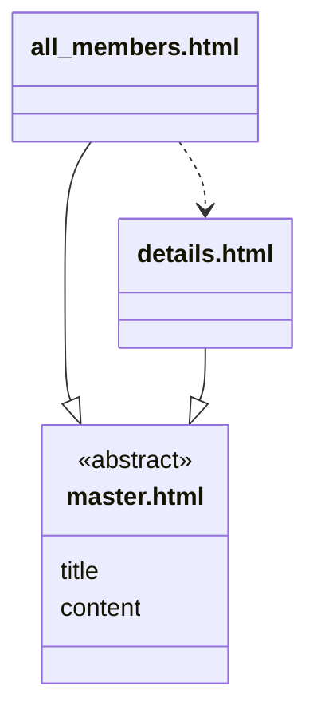
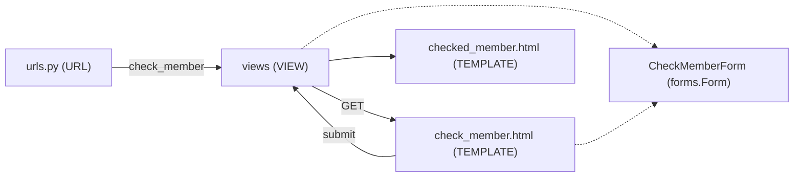
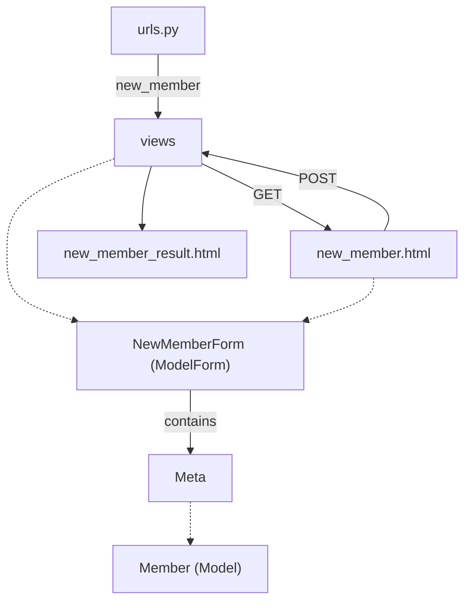

# Ch09 Django Application

## 9.3 網球俱樂部 (II)
> 📌 **快速導覽 (Quick Navigation)**
> * [9.3.1 資料庫限制](#931-資料庫限制)
> * [9.3.2 Lab04: 管理者與資料庫異動 (`admin`)](#932-lab04-管理者與資料庫異動-admin)
> * [9.3.3 Lab05: 細節資料與擴充頁面 (`details`)](#933-lab05-細節資料與擴充頁面-details)
> * [9.3.4 Lab06: 主畫面 (`index`)](#934-lab06-主畫面-index)
> * [9.3.5 Lab07: 查詢會員 (`form_get`)](#935-lab07-查詢會員-form_get)
> * [9.3.6 Lab08: 用表單新增會員 (`form_post`)](#936-lab08-用表單新增會員-form_post)
> * [9.3.7 隨堂測驗](#937-隨堂測驗)

---

### 9.3.1 資料庫限制

在設計資料庫時，為了確保資料的**完整性 (Integrity)** 和**有效性 (Validity)**，我們需要定義各種限制 (Constraints)。這些限制會在資料庫層級強制執行，防止不符合規則的資料被寫入。

以下是一些常見的資料庫限制及其在 Django 模型中的對應方式：

* **1. 資料類型限制 (Data Type Constraints)**

  * **定義：** 每個欄位都必須儲存特定類型 (例如：整數、字串、日期等) 的資料。這是最基本的限制。
  * **Django 範例：** Django 模型中的每個欄位都必須指定一個 Field 類型，例如 `IntegerField`, `CharField`, `DateField`, `EmailField` 等。

      ```python
      from django.db import models

      class Product(models.Model):
          name = models.CharField(max_length=100)  # 字串類型，限制最大長度
          price = models.DecimalField(max_digits=10, decimal_places=2)  # 十進位類型，限制總位數和小數位數
          quantity = models.IntegerField()  # 整數類型
          is_available = models.BooleanField(default=True)  # 布林類型
          created_at = models.DateTimeField(auto_now_add=True)  # 日期時間類型
      ```

* **2. 非空限制 (NOT NULL Constraint)**

  * **定義：** 確保欄位的值不能為 `NULL`。
  * **Django 範例：** 在 Django 模型中，預設情況下欄位允許 `NULL` 值。要設定非空限制，需要將 `null` 參數設為 `False`。

      ```python
      class Category(models.Model):
          name = models.CharField(max_length=50, null=False)  # name 欄位不能為 NULL
      ```

**null 與 blank**

  `null` 和 `blank` 常常搞混，前者是**資料庫限制**，後者是**表單限制**。基於 `phone = models.CharField(max_length=20, null=False, blank=True)` 對應 TT, TF, FT, FF 四種狀況，說明了 `null` 和 `blank` 的組合及其含義：

  |  `null`   |  `blank`  |  狀況  | 含義 (針對 `phone` 欄位)                                                                                                                                                                         |
  | :-------: | :-------: | :----: | :----------------------------------------------------------------------------------------------------------------------------------------------------------------------------------------------- |
  | **True**  | **True**  | **TT** | 資料庫**允許** `NULL` 值。Django 表單**允許**留空字串 (`''`)。電話號碼在資料庫中可以是沒有值 (`NULL`) 的，使用者在表單中也可以不填寫。                                                           |
  | **True**  | **False** | **TF** | 資料庫允許 `NULL` 值。Django 表單**不允許**留空字串 (`''`)。電話號碼在資料庫中可以是沒有值 (`NULL`) 的，但是使用者在表單中**必須填寫**，不能留空。                                               |
  | **False** | **True**  | **FT** | 資料庫**不允許** `NULL` 值。Django 表單允許留空字串 (`''`)。電話號碼在資料庫中**必須有值** (但可以是空字串 `''`)，使用者在表單中可以不填寫。當表單留空提交時，資料庫會儲存空字串 (`''`)。        |
  | **False** | **False** | **FF** | 資料庫**不允許** `NULL` 值。Django 表單**不允許**留空字串 (`''`)。電話號碼在資料庫中**必須有值** (且不能是 `NULL`)，使用者在表單中**必須填寫**，不能留空。這是強制要求使用者提供電話號碼的設定。 |


* **3. 唯一性限制 (UNIQUE Constraint)**

  * **定義：** 確保欄位中的所有值都是唯一的。
  * **Django 範例：** 使用 `unique=True` 參數可以為欄位增加唯一性限制。

      ```python
      class User(models.Model):
          username = models.CharField(max_length=30, unique=True)  # username 必須是唯一的
          email = models.EmailField(unique=True)  # email 也必須是唯一的
      ```
      也可以在模型層級定義多個欄位的聯合唯一性約束：

      ```python
      class Meta:
          unique_together = (('first_name', 'last_name'),)  # first_name 和 last_name 的組合必須是唯一的
      ```
      或者使用 `UniqueConstraint` (Django 2.2+):

      ```python
      from django.db.models import UniqueConstraint

      class Person(models.Model):
          first_name = models.CharField(max_length=30)
          last_name = models.CharField(max_length=30)

          class Meta:
              constraints = [
                  UniqueConstraint(fields=['first_name', 'last_name'], name='unique_full_name')
              ]
      ```

* **4. 主鍵限制 (PRIMARY KEY Constraint)**

  * **定義：** 唯一標識資料表中的每一行。每個資料表只能端有一個主鍵。主鍵通常是非空且唯一的。
  * **Django 範例：** Django 模型預設會自動建立一個名為 `id` 的 `AutoField` 欄位作為主鍵。你可以選擇其他欄位作為主鍵，但通常不建議修改預設行為。

      ```python
      class Book(models.Model):
          book_id = models.AutoField(primary_key=True)  # 明確指定 book_id 為主鍵 (通常不需要)
          title = models.CharField(max_length=200)
      ```

* **5. 外鍵限制 (FOREIGN KEY Constraint)**

  * **定義：** 用於建立和強制執行不同資料表之間的關係。外鍵欄位的值必須參考另一個資料表的主鍵。
  * **Django 範例：** 使用 `ForeignKey` 欄位來定義外鍵關係。

      ```python
      class Author(models.Model):
          name = models.CharField(max_length=100)

      class Article(models.Model):
          title = models.CharField(max_length=200)
          author = models.ForeignKey(Author, on_delete=models.CASCADE)  # author 是外鍵，參考 Author 模型
      ```
      * `on_delete`: 定義當參考的父物件被刪除時，子物件應該如何處理 (`CASCADE`, `PROTECT`, `SET_NULL`, `SET_DEFAULT`, `DO_NOTHING` 等)。
          * `CASCADE`: author 被刪除，其所關聯 the article 一起被刪除。
          * `PROTECT`: 刪除 author 時，因為已有 book 與之關聯，會跳出警告避免被刪。
          * `SET_NULL`: author 被刪除，Article 相關聯的 author 欄位被設為 null。Article 的 author 必須允許為 null (`null=True`)。
          * `SET_DEFAULT`: author 被刪除時，Article 中的 author 設為預設值(如 `default="unknown"`)。
          * `DO_NOTHING`: author 被刪就被刪，不做任何處理，強烈不建議，會造成資料的不完整。

* **6. 檢查限制 (CHECK Constraint)**

  * **定義：** 定義一個布林表達式，用於限制欄位中允許的值。只有滿足表達式的值才能被接受。
  * **Django 範例：** Django 模型在早期版本中沒有直接支援 CHECK constraint。從 Django 3.2 開始，可以使用 `CheckConstraint` (Django 3.2+)。

      ```python
      from django.db.models import CheckConstraint, Q

      class Order(models.Model):
          quantity = models.IntegerField()
          status = models.CharField(max_length=20)

          class Meta:
              constraints = [
                  CheckConstraint(check=Q(quantity__gt=0), name='quantity_greater_than_zero'),
                  CheckConstraint(check=Q(status__in=['pending', 'processing', 'shipped', 'delivered']), name='valid_status')
              ]
      ```

* **7. 預設值限制 (DEFAULT Constraint)**

  * **定義：** 為欄位指定一個預設值，當在插入新記錄時沒有提供該欄位的值時，將使用預設值。
  * **Django 範例：** 使用 `default` 參數為欄位設定預設值。

      ```python
      class Task(models.Model):
          description = models.TextField()
          is_completed = models.BooleanField(default=False)  # 預設為 False
          priority = models.IntegerField(default=3)  # 預設優先級為 3
      ```

* **8. 長度限制 (LENGTH Constraint)**

  * **定義：** 限制字串或二進制資料欄位的最大長度。
  * **Django 範例：** `CharField` 和 `TextField` 可以使用 `max_length` 參數來設定最大長度。

      ```python
      class BlogPost(models.Model):
          title = models.CharField(max_length=255)  # 標題最大長度為 255
          content = models.TextField()
      ```

* **9. 列舉限制 (ENUM Constraint)**

  * **定義：** 限制欄位只能從預先定義的一組值中選擇。
  * **Django 範例：** Django 雖然有 Enum 類型，也常用 `TextChoices` 搭配 `choices` 參數來模擬列舉限制。

      ```python
      class OrderStatus(models.TextChoices):
          PENDING = 'PD', 'Pending'
          PROCESSING = 'PR', 'Processing'
          SHIPPED = 'SH', 'Shipped'
          DELIVERED = 'DE', 'Delivered'

      class Shipment(models.Model):
          status = models.CharField(max_length=2, choices=OrderStatus.choices, default=OrderStatus.PENDING)
      ```

**總結**

合理地使用資料庫的各種限制對於建立一個健壯、可靠的應用程式至關重要。它們有助於確保資料的準確性、一致性和完整性。Django 的模型定義提供了方便的方式來聲明這些限制，並且 Django 的 ORM 會在與資料庫互動時考慮這些限制。在設計模型時，仔細思考每個欄位的限制，將有助於避免後續的資料問題。

### 9.3.2 Lab04: 管理者與資料庫異動 (`admin`)
> [!NOTE]
> 🏈 You will learn
> * 如何建立一個管理者 (admin) 的帳號和密碼
> * 如何修改資料庫的資料表，需要注意哪些設定
> * 建立資料表時，額外的參數設定
> See branch **[admin](https://github.com/nlhsueh/nlh_tennis_club/tree/admin)**


#### 建立管理者

```
py manage.py createsuperuser
```
* 你可以用 admin 或是取其他的名字，接著設定密碼。
* 建立後就可以到 [http://127.0.0.1:8000/admin](http://127.0.0.1:8000/admin) 操作。
* 在 admin 的管理中加上 members 等模組，如此 admin 才看得到這些資料。See [W3School- admin include models](https://www.w3schools.com/django/django_admin_include_members.php)

```python
from django.contrib import admin
from .models import Member

# Register your models here.
admin.site.register(Member)
```

#### 資料庫異動之處理

幫每一個會員增加屬性：電話及加入日期，他們的型態分別是整數與日期。
* `IntegerField`
* `DateField`

```python
class Member(models.Model):
   firstname = models.CharField(max_length=255)
   lastname = models.CharField(max_length=255)
   phone = models.IntegerField()
   joined_date = models.DateField()
```

`DateField` 的生成方法- 透過字串
```python
from members.models import Member
x = Member.objects.all()[0]
x.phone = 5551234
x.joined_date = '2022-01-05'
x.save()
```

**更新資料庫結構可能產生的問題**：假設資料庫中有六個會員，本來的欄位只有姓名 (firstname, lastname)，現在增加了電話與日期，如果這兩個欄位被設定為「不可空值」，那麼前面的六個會員就會違反資料庫的設定。解決方法：
1. 改為可以 null
2. 設定一個預設值
3. 先改為可以 null, 增加欄位資料後再改回來

👉 [See w3school- django update model](https://www.w3schools.com/django/django_update_model.php)

👉 [See django doc- more data types](https://docs.djangoproject.com/en/5.0/ref/models/fields/)

#### 資料欄位的延伸設定

```python
firstname = models.CharField(max_length=255,
                            null=True,
                            blank=True)
```

以下是 Django 中 CharField 常用的參數及其說明的表格整理：

| 參數名稱       | 說明                                                         |
| -------------- | ------------------------------------------------------------ |
| max_length     | 字串的最大長度。                                             |
| blank          | 表示字串是否可以為空值。預設為 False。是表單檢查相關的。     |
| null           | 資料庫中的字串是否可以為空值。預設為 False。是資料庫相關的。 |
| default        | 字串的預設值。                                               |
| choices        | 定義選項的列舉，用於限制可選的值。                           |
| verbose_name   | 字串的人類可讀名稱，用於在管理界面顯示。                     |
| help_text      | 字串的幫助文字，用於在管理界面顯示字串的說明。               |
| primary_key    | 字串是否為資料的主鍵。預設為 False。                         |
| unique         | 表示字串的值是否唯一。預設為 False。                         |
| editable       | 表示字串是否可以在管理界面中編輯。預設為 True。              |
| error_messages | 定義自定義錯誤消息的字典，用於定義錯誤的顯示。               |

👉 [See geeksforgeeks- CharField](https://www.geeksforgeeks.org/charfield-django-models/)

🏀 在資料庫 model 中，加上 `unique`, `verbose_name`, `help_text`, `error_message` 等參數，觀察在 admin 頁面的變化。 

❓ 說明以下含義：
```python
phone = models.IntegerField(null=True, 
                            blank=True,
                            verbose_name='電話')
joined_date = models.DateField(null=True,
                               blank=True,
                               verbose_name='入會日期',
                               default=datetime.date.today(),
                               help_text='the day he pay fee',
                               editable=True,
                               )
```

### 隨堂測驗

* **[Lab隨堂測驗](https://github.com/nlhsueh/nlh_tennis_club/blob/admin/quiz.md)**

### 9.3.3 Lab05: 細節資料與擴充頁面 (`details`)

> [!NOTE]
> 🏈 You will learn
> * 細節資料的頁面設計
> * 主頁面與擴充頁面的設計，以提升主頁面設計的可重用性，將地程式開發的複雜度。
> * See branch **[details](https://github.com/nlhsueh/nlh_tennis_club/tree/details)**

<概述資料-細節資料>的呈現常常在資訊系統中出現：在概述資料中，我們呈現「一群」資料的概述，當我們點擊某一筆資料的時候，就會出現細節(detail)資料的全貌。
* members 是一個集合物件，透過 `id` 指定明確物件，近一步呈現某會員的細節資料。

#### 細節資料的頁面設計

Template:

> `my_tennis_club/members/templates/details.html`:

呈現某一個會員的資料
```html
<!DOCTYPE html>
<html>
<body>
  <h1>{{ mymember.firstname }} {{ mymember.lastname }}</h1>  
  <p>Phone: {{ mymember.phone }}</p>
  <p>Member since: {{ mymember.joined_date }}</p>
  <p>Back to <a href="/members">Members</a></p>
</body>
</html>
```

View:

> `my_tennis_club/members/views.py:`

透過 `Member.objects.get(id = id)` 來獲得`id` 的資訊，然後傳過去`details.html`。注意 `details` 有兩個參數，第二個是 `id`:

```python
def details(request, id):
  mymember = Member.objects.get(id = id)
  template = loader.get_template('details.html')
  context = {
    'mymember': mymember,
  }
  return HttpResponse(template.render(context, request))
```  

第二個參數 `id` 哪裡來的呢？我們的 url 路徑：

> `my_tennis_club/members/urls.py:`

```python
from django.urls import path
from . import views

urlpatterns = [
    path('members/', views.members, name='members'),
    path('members/details/<int:id>', views.details, name='details'),
]
```

其中 `<int:id>` 表示是一個整數變數，並不是固定的路徑。

#### 概述資料的頁面設計

修改 `all_member.html`, 添加 `a` 標記，做出連接：
> `my_tennis_club/members/templates/all_members.html:`

👉 重點在第 9 行的 `a` 標記
```html
<!DOCTYPE html>
<html>
<body>

<h1>Members</h1>
  
<ul>
  
    <li><a href="details/{{ x.id }}">{{ x.firstname }} {{ x.lastname }}</a></li>
  
</ul>
    
</body>
</html>
```

#### 頁面擴充標記

**主頁面** (Master) 類似製作投影片的母片，把大架構確立出來，細節由擴充頁面來提供。宣告一些「被擴充區塊」，用``及`` 標記。以下宣告了 `title` 及 `content` 兩個區塊，等待擴充。

> my_tennis_club/members/templates/master.html:

```html
<!DOCTYPE html>
<html>
<head>
  <title></title>
</head>
<body>




</body>
</html>
```

**擴充頁面**，先在一開始宣告要擴充的頁面（利用``標記），接下來「覆蓋」個擴充區塊- 同樣用 ``及``。

`all_members.html` 是擴充頁面:

> `my_tennis_club/members/templates/all_members.html:`

```html



  My Tennis Club - List of all members




  <h1>Members</h1>
  
  <ul>
    
      <li><a href="details/{{ x.id }}">{{ x.firstname }} {{ x.lastname }}</a></li>
    
  </ul>

```
* 要擴充 `master.html`
* 覆蓋 `master.html` 中的兩個區塊： `title` 以及 `content` 

`details.html` 也是擴充頁面：

> `my_tennis_club/members/templates/details.html:`

```html



  Details about {{ mymember.firstname }} {{ mymember.lastname }}




  <h1>{{ mymember.firstname }} {{ mymember.lastname }}</h1>
  
  <p>Phone {{ mymember.phone }}</p>
  <p>Member since: {{ mymember.joined_date }}</p>
  
  <p>Back to <a href="/members">Members</a></p>
  

```

下圖是一個結構的示意（S在此表示一個頁面), 三角形的符號表示一個擴充。



#### 隨堂測驗

[Lab Quiz](https://github.com/nlhsueh/nlh_tennis_club/blob/details/quiz.md)

### 9.3.4 Lab06: 主畫面 (`index`)

> [!NOTE]
> 🏈 You will do
> * 一個系統的首頁，並且讓其他分頁可以快速回到首頁
> * 如何關閉與開啟除錯模式
> * 當除錯模式關閉時，如何將系統錯誤引導到錯誤說明頁面。
> See branch **[index](https://github.com/nlhsueh/nlh_tennis_club/tree/index)**

* 做一個系統的 主畫面- [main.html](https://github.com/nlhsueh/nlh_tennis_club/blob/index/members/templates/main.html); 路由要記得設定 ([urls.py](https://github.com/nlhsueh/nlh_tennis_club/blob/index/members/urls.py))
* 再設定檔 [setting.py](https://github.com/nlhsueh/nlh_tennis_club/blob/index/my_tennis_club/settings.py) 關閉除錯模式 -- 也就是設定 `default=False`。系統出錯時，就不會出現除錯資訊，會自動轉到 `404.html`。
* 修改 [view.py](https://github.com/nlhsueh/nlh_tennis_club/blob/index/members/views.py), 加上 `main(request)` 的導向
* 建立一新檔 [404.html](https://github.com/nlhsueh/nlh_tennis_club/blob/index/members/templates/404.html)-- 撰寫系統出現時，要給使用者的訊息。
* 修改 [master.html](https://github.com/nlhsueh/nlh_tennis_club/blob/index/members/templates/master.html), 加上回到首頁的連接。
* Read [w3school example](https://www.w3schools.com/django/django_add_main.php) for more information.


❓ 如果不想用預設的 404.html, 該如何設定？ (Ans: see [here](https://www.geeksforgeeks.org/how-to-fix-page-not-found-404-django/))


#### 隨堂測驗
[Lab Quiz](
https://github.com/nlhsueh/nlh_tennis_club/blob/index/quiz.md)

### 9.3.5 Lab07: 查詢會員 (`form_get`)
> [!NOTE]
> 🏈 You will learn
> * 如何設計一個輸入表單，和後端的 django 互動
> * form GET 和 POST 的差異
> See branch **[form_get](https://github.com/nlhsueh/nlh_tennis_club/tree/form_get)**

* 做一個輸入表單，透過 lastname 來查詢會員

#### lab7.1 查詢頁面
> check_member.html: 

```html
<form action="" method="GET">
  <label for="last_name">Last name:</label><br>
  <input type="text" id="last_name" name="last_name"><br><br>
  <input type="submit" value="Submit">
</form> 
```
或是由後端來做，設計一個 [CheckMemberForm](https://github.com/nlhsueh/nlh_tennis_club/blob/form_get/members/forms.py) - 它是 `forms.Form` 的子類別：

```html
<form action = "" method = "GET">
    {{ form.as_p }}
    <input type="submit" value='Submit'>
</form>
```
* `as_p` 是將 form 用 p 元件來呈現，其他還有 `as_table`, `as_list`



#### lab7.2 路由設定

加上新的路由到 [urls.py](https://github.com/nlhsueh/nlh_tennis_club/blob/form_get/members/urls.py)
```python
path('members/check_member', views.check_member, name='check_member'),
```


#### lab7.3 查詢的處理 (views)

* 第一次呼叫 [views.check_member](https://github.com/nlhsueh/nlh_tennis_club/blob/form_get/members/views.py), 是由 urls 導向過來的，`request.method` 是 `GET`, 但 `request.GET` 是空的。此時我們引導到 [check_member.html](https://github.com/nlhsueh/nlh_tennis_club/blob/form_get/members/templates/check_member.html)
* 當使用者在 `check_member.html` 中輸入 `last_name` 的值並提交後，會再次執行 `views.check_member`, 此時 `request.GET` 會包含使用者在 form 中所填寫的值。我們透過 `Member.objects.filter()` 來找到所有符合條件的物件，在引導到 [checked_members.html](https://github.com/nlhsueh/nlh_tennis_club/blob/form_get/members/templates/checked_members.html).

### 9.3.6 Lab08: 用表單新增會員 (`form_post`)

> [!NOTE]
> 🏈 You will learn
> * POST request 如何被處理，如何將使用者輸入的資料存到資料庫
> * ModelForm 的設計與應用
> See branch **[form_post](https://github.com/nlhsueh/nlh_tennis_club/tree/form_post)**

1. 設計一個資料表單 [NewMemberForm](https://github.com/nlhsueh/nlh_tennis_club/blob/form_post/members/forms.py), 可以用來呈現介面，同時儲存到資料庫。記得是繼承 `ModelForm`。
2. 新增路由到 [urls.py](https://github.com/nlhsueh/nlh_tennis_club/blob/form_post/members/urls.py)
3. 設計 [new_member.html](https://github.com/nlhsueh/nlh_tennis_club/blob/form_post/members/templates/new_member.html): 透過 POST 方式，將提交的資料存到資料庫。注意我們是用資料表單來產生介面表單(`form.as_p()`)。
    * `as_p`: as paragraph
    * `as_table`: table
    * `as_ul`: list
    * 資安考量，POST 請求都必須加上 ``。
        * **目的**：防止跨站請求偽造 (Cross-Site Request Forgery, CSRF) 攻擊，確保 POST 請求是來自網站本身的表單，而非惡意網站的偽造請求。
        * **原理**：Django 會在表單中插入一個隱藏的 `<input>` 欄位，內含隨機生成的 token 字串，同時在瀏覽器 Cookie 中也會記錄對應的 token。當表單提交時，Django 伺服器會比對請求中的 token 與 Cookie 中的 token 是否相符，若不符則會拒絕該請求 (回傳 403 Forbidden 錯誤)。
4. 在 [view.py](https://github.com/nlhsueh/nlh_tennis_club/blob/form_post/members/views.py) 中加上 `new_member(request)`: 判斷是 `POST` 請求後，依據取得的資料(`request.POST`)生成一個 `NewMemberForm` 物件，檢查此提交的表單是否正確 (`is_valid`)，確認正確後直接呼叫 `save()` 儲存。
    * 若無法儲存，可以透過 `form.error` 取得錯誤資訊。
    * 如果是 GET 請求，將之轉到 `new_member.html`
5. 無論成功或失敗，都引導到 [new_member_result.html](https://github.com/nlhsueh/nlh_tennis_club/blob/form_post/members/templates/new_member_result.html)


> CSRF 攻擊（Cross-Site Request Forgery，跨站請求偽造）是一種挾制使用者在當前已登入的 Web 應用程式上執行非本意操作的網路攻擊手法。攻擊者會利用瀏覽器自動夾帶 Cookie 的機制，盜用使用者在目標網站的身分憑證來發送惡意請求。CSRF 攻擊之首要條件是使用者必須先通過目標網站的身分驗證。其典型攻擊流程如下：
1. 登入網站：使用者登入信任的銀行網站 `A.com`，瀏覽器在儲存認證 Cookie 後未登出。
2. 點擊惡意連結：使用者在未登出的情況下，點擊了駭客佈署的惡意網站 `B.com`。
3. 觸發偽造請求：惡意網站 `B.com` 隱藏了針對 `A.com` 的轉帳或修改密碼表單，並在背景自動提交。
4. 瀏覽器發送憑證：瀏覽器處理該請求時，會自動帶上使用者在 `A.com` 的 Cookie 憑證。(雖然 B 不知道 Cookie 的內容，但因為 `B.com` 的目標也是 `A.com`, 瀏覽器會自動帶上 `A.com` 的 Cookie)
5. 目標網站誤信：`A.com` 收到帶有正確 Cookie 的請求，誤以為是使用者的自主操作而執行。


See [branch **form_post**](https://github.com/nlhsueh/nlh_tennis_club/tree/form_post)


❓ 輸入的時候如果要一些表單檢查的話該怎麼做？例如 joined_date 不可晚於今天。[Hint](https://www.geeksforgeeks.org/python-form-validation-using-django/)。

### 9.3.7 隨堂測驗

本單元的隨堂測驗旨在檢驗學生對於 9.3.1 - 9.3.6 各個單元的學習成果。

> 💡 **學習指引**：  
> 本單元採用了漸進式的 Git 分支開發，建議學生在閱讀與實作各個單元（Lab）時，點選各單元下方的 **Lab Quiz** 連結，直接切換到對應分支進行完整的單元隨堂測驗與練習：
> * **9.3.2 Lab04 (admin)** ➔ [Lab Quiz (admin)](https://github.com/nlhsueh/nlh_tennis_club/blob/admin/quiz.md)
> * **9.3.3 Lab05 (details)** ➔ [Lab Quiz (details)](https://github.com/nlhsueh/nlh_tennis_club/blob/details/quiz.md)
> * **9.3.4 Lab06 (index)** ➔ [Lab Quiz (index)](https://github.com/nlhsueh/nlh_tennis_club/blob/index/quiz.md)
> * **9.3.5 Lab07 (form_get)** ➔ [Lab Quiz (form_get)](https://github.com/nlhsueh/nlh_tennis_club/blob/form_get/quiz.md)
> * **9.3.6 Lab08 (form_post)** ➔ [Lab Quiz (form_post)](https://github.com/nlhsueh/nlh_tennis_club/blob/form_post/quiz.md)

以下為從各個 Lab Quiz 中精選的代表性選擇題，供同學們進行綜合自我檢測：

---

1️⃣ 關於 Django 模型中 `null` 與 `blank` 的設定，下列哪一個選項正確描述了「**FT（null=False, blank=True）**」的組合對應字串欄位（如 CharField）的行為？
- (A) 資料庫允許 `NULL` 值，且 Django 表單不允許留空。
- (B) 資料庫允許 `NULL` 值，且 Django 表單允許留空。
- (C) 資料庫**不允許** `NULL` 值，但 Django 表單**允許**留空。當表單留空提交時，資料庫會儲存空字串 `''`。
- (D) 資料庫**不允許** `NULL` 值，且 Django 表單**不允許**留空。使用者必須強制填寫。

<details>
<summary>解答</summary>
(C)。  
說明：`null` 控制的是資料庫限制是否可以儲存 `NULL`；`blank` 控制的是表單驗證限制是否可以留空。當設定為 FT (null=False, blank=True) 時，表單允許留空（不填寫），但因為資料庫不允許寫入 `NULL`，Django 在表單留空提交時會將其轉為空字串 `''`（對於字串欄位）並安全地寫入資料庫，從而避免資料庫拋出 `NOT NULL` 錯誤。
</details>

---

2️⃣ 在 Django 中設定外鍵關係（ForeignKey）時，如果我們希望在刪除父物件（例如 Author）時，**阻止 (Prevent)** 該刪除操作，因為已經有子物件（例如 Article）與之關聯，避免意外刪除造成資料毀損，應在 `on_delete` 中設定哪一個參數？
- (A) `models.CASCADE`
- (B) `models.PROTECT`
- (C) `models.SET_NULL`
- (D) `models.DO_NOTHING`

<details>
<summary>解答</summary>
(B)。  
說明：`models.PROTECT` 會阻止刪除父物件。如果父物件底下已有被關聯的子物件，Django 會拋出 `ProtectedError` 警告，阻止管理員刪除該父物件。
</details>

---

3️⃣ 要在 Django 專案中建立一個全域的管理者（後台系統管理員）帳號與密碼，應在終端機中執行哪一個命令？
- (A) `python manage.py createsuperuser`
- (B) `python manage.py createadmin`
- (C) `python manage.py makemigrations`
- (D) `python manage.py runserver`

<details>
<summary>解答</summary>
(A)。  
說明：在終端機執行 `python manage.py createsuperuser` 會啟動互動式提示，引導您輸入管理員用戶名稱、Email 與密碼，成功後即可登入後台系統管理介面（`/admin`）。
</details>

---

4️⃣ 為了在 Django Admin 後台管理系統中管理我們自訂的模型（例如 `Member`），必須在該 App 的哪一個檔案中進行註冊？
- (A) `models.py`
- (B) `admin.py`
- (C) `views.py`
- (D) `urls.py`

<details>
<summary>解答</summary>
(B)。  
說明：要將模型載入 Admin 管理系統，必須在該 App 的 `admin.py` 中使用 `admin.site.register(<ModelName>)` 來註冊，使其自動在後台生成資料管理表格介面。
</details>

---

5️⃣ 在 Django 的 URL 路由設定（`urls.py`）中，如果我們要擷取 URL 中的整數 ID 作為參數傳遞給視圖函數（例如從 `members/details/5` 擷取出整數 `5` 並傳給 `id` 參數），應該使用下列哪一個路徑宣告格式？
- (A) `path('members/details/<id>', views.details)`
- (B) `path('members/details/<int:id>', views.details)`
- (C) `path('members/details/{id}', views.details)`
- (D) `path('members/details/<str:id>', views.details)`

<details>
<summary>解答</summary>
(B)。  
說明：Django 提供了路徑轉換器（Path Converters）來捕獲網址參數。`<int:id>` 代表捕獲一個整數型態的參數，並將其命名為 `id` 傳遞給視圖函數。
</details>

---

6️⃣ 關於 Django 的模板繼承（Template Inheritance）機制，子模板（Child Template）必須在檔案最頂端使用哪一個標籤（Tag）來宣告其要承襲哪一個母模板（Parent Template）的網頁結構？
- (A) ``
- (B) ``
- (C) ``
- (D) ``

<details>
<summary>解答</summary>
(C)。  
說明：`` 是 Django 模板系統中宣告繼承關係的唯一專屬標籤，且必須放在子模板檔案的最上方第一行。
</details>

---

7️⃣ 當我們把 Django 應用程式部署到正式生產環境時，為了安全性與效能，必須將 `settings.py` 中的 `DEBUG` 變數設定為下列何者？
- (A) `True`
- (B) `False`
- (C) `None`
- (D) `'production'`

<details>
<summary>解答</summary>
(B)。  
說明：部署上線時為了安全性與隱私，**必須**將 `DEBUG` 設定為 `False`。如果為 `True`，當網頁出錯時，Django 會在網頁上顯示詳細的錯誤 traceback 堆疊與環境變數，包含資料庫密碼與 API 金鑰等敏感資訊，容易引發重大資安漏洞。
</details>

---

8️⃣ 當我們在 `settings.py` 中將 `DEBUG` 設定為 `False` 後，若沒有正確設定哪一個變數，Django 在啟動或接收請求時會直接拋出 `CommandError` 或 `Bad Request (400)` 錯誤？
- (A) `SECURE_HOSTS`
- (B) `TRUSTED_DOMAINS`
- (C) `ALLOWED_HOSTS`
- (D) `SERVER_NAMES`

<details>
<summary>解答</summary>
(C)。  
說明：當除錯模式關閉（`DEBUG = False`）時，Django 為了防範 HTTP Host Header 攻擊，會嚴格檢查 Request 的域名是否合法。`ALLOWED_HOSTS` 是一個清單，用來指定該 Django 專案允許運行的主機名稱或 IP 地址。若在測試階段想允許所有 Host，可以設定為 `ALLOWED_HOSTS = ['*']`。
</details>

---

9️⃣ 在 HTML 模板中，如果我們在 `{{ form }}` 後面呼叫不同的方法，如 `{{ form.as_p }}`、`{{ form.as_table }}` 或 `{{ form.as_ul }}`，它們的主要區別是什麼？
- (A) `as_p` 會將表單轉換為 PDF 格式，`as_table` 會將其轉換為 Excel 表格。
- (B) 它們代表不同的表單發送方式（例如 POST 或 GET）。
- (C) 它們會影響表單欄位在網頁上的 HTML 排版結構（分別包裹在 `<p>`、`<tr>`、`<li>` 標籤中）。
- (D) 它們分別用於不同權限等級的使用者登入表單呈現。

<details>
<summary>解答</summary>
(C)。  
說明：`as_p` 會將每個欄位和其 Label 包裹在 `<p>` 標籤中；`as_table` 會將每個欄位包裹在 HTML 的表格列 `<tr>` 標籤中（因此開發者必須在外面手動加上 `<table>...</table>`）；`as_ul` 則會將其包裹在無序列表項目 `<li>` 中（外面需手動加上 `<ul>...</ul>`）。這幾種方法僅影響渲染出來的 HTML 標籤排版。
</details>

---

🔟 在 Django 中，關於使用 GET 方法來設計查詢表單的特性，下列敘述何者錯誤？
- (A) 表單資料會被附加在 URL 的後半部，成為 Query String。
- (B) 因為資料會顯眼地顯示在瀏覽器網址列中，所以非常適合用於密碼變更或信用卡結帳等安全性要求高的情境。
- (C) 使用 GET 查詢的結果網址可以被使用者加入書籤，方便下次直接造訪相同的查詢結果頁面。
- (D) 瀏覽器通常會對 GET 的 URL 長度有一定限制，因此不適合用來傳送大量的檔案或超長文字。

<details>
<summary>解答</summary>
(B)。  
說明：GET 方法 the 資料會直接暴露在網址列中，且會留在瀏覽器的歷史紀錄、代理伺服器日誌或伺服器日誌中。因此，絕對不可將 GET 用於密碼、信用卡、敏感個人資料等安全性要求高的傳輸情境（這類情境應使用 POST 請求，並配合 CSRF 保護）。
</details>

---

1️⃣1️⃣ 關於 Django 中的 `ModelForm`，下列敘述何者正確？
- (A) `ModelForm` 與普通 `Form` 相同，無法直接將使用者填寫的表單資料儲存進資料庫，仍需手動撰寫 SQL。
- (B) `ModelForm` 需要定義一個內嵌類別 `class Meta`，其中必須包含 `model` 屬性來指定關聯的 Model，以及 `fields` 屬性指定要在表單中呈現的欄位。
- (C) 在 `class Meta` 中，`fields = "__all__"` 的作用是「排除」所有的 Model 欄位，不讓它們呈現在網頁表單中。
- (D) 如果在 `ModelForm` 中修改了 `widgets` 或 `labels`，我們必須在終端機中執行 `makemigrations` 來進行資料庫結構遷移。

<details>
<summary>解答</summary>
(B)。  
說明：`ModelForm` 需要透過巢狀的 `Meta` 類別來設定綁定的 `model` 與要包含的欄位 `fields`，這是它的標準設計結構。`fields = "__all__"` 代表包含所有該 Model 的欄位，且修改前端 widgets 或 labels 不涉及資料庫結構變動，因此不需進行 migration。
</details>

---

1️⃣2️⃣ 在 Django 專案中，當表單改用 `POST` 方法傳送資料時，我們必須在 HTML `<form>` 標籤內加上 `` 標籤。請問其最核心的作用是什麼？
- (A) 加速表單的網頁傳輸與渲染效率。
- (B) 防範跨站請求偽造（Cross-Site Request Forgery, CSRF）安全攻擊，確保該 POST 請求是來自我們網站本身的表單。
- (C) 用來自動檢查表單的必填欄位是否為空白。
- (D) 將表單中的資料自動加密，使得資料庫中的敏感資料也呈現加密狀態。

<details>
<summary>解答</summary>
(B)。  
說明：`` 會在渲染的表單中自動插入一個隱藏的 `<input type="hidden" name="csrfmiddlewaretoken" ...>` 欄位，內含一個隨機生成的 token 字串。當表單提交時，Django 伺服器會比對請求中的 token 與使用者瀏覽器 Cookie 中的 token 是否一致，若不符則會拒絕該 POST 請求（回傳 403 Forbidden 錯誤），藉此防範跨站請求偽造攻擊。
</details>
