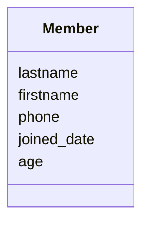
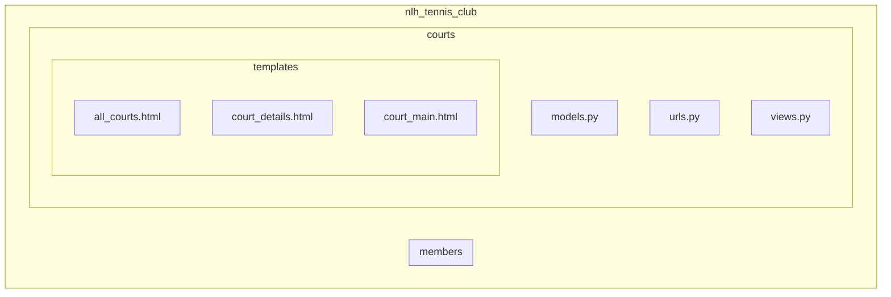
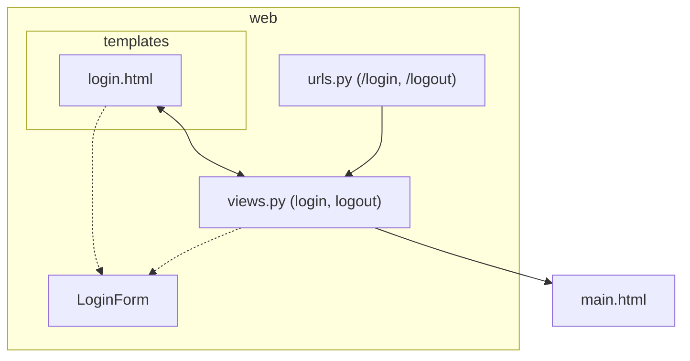
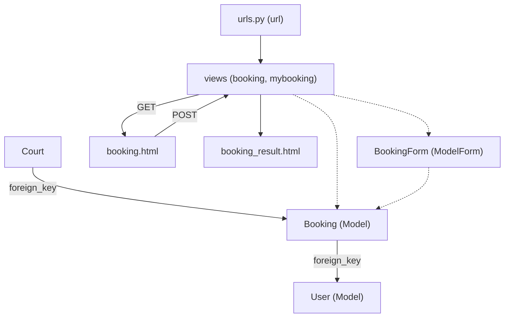
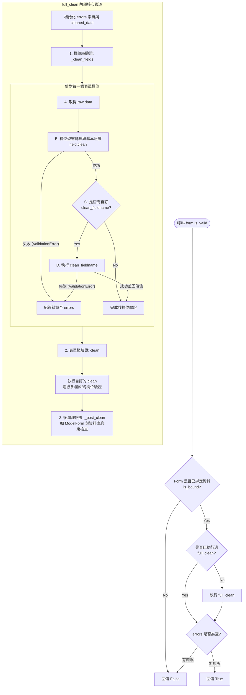

# Ch09 Django Application

## 9.4 網球俱樂部 (III)
> 📌 **快速導覽 (Quick Navigation)**
> * [9.4.1 ex01: tag if (age)](#941-ex01-tag-if-age)
> * [9.4.2 ex02: enum (court)](#942-ex02-enum-court)
> * [9.4.3 ex03 (web)](#943-ex03-web)
> * [9.4.4 ex04 (static)](#944-ex04-static)
> * [9.4.5 ex05 (bs)](#945-ex05-bs)
> * [9.4.6 ex06 (validation)](#946-ex06-validation)
> * [9.4.7 ex07 (img)](#947-ex07-img)
> * [9.4.8 ex08 (bind_user)](#948-ex08-bind_user)
> * [9.4.9 隨堂測驗](#949-隨堂測驗)

---
### 9.4.1 ex01: tag if (age)
> [!NOTE]
> 🏈 年齡分組
> * 在 model 中為會員增加一個欄位 age
> * 修改 all members, 會分兩個區塊，一個是小於 20 歲的青少年組，一個是超過 20 歲的成人組。
> 
> 學習重點
> * template tag: if
> * `py manage.py makemigrations`; `py manage.py migrate`
> * See branch **[age](https://github.com/nlhsueh/nlh_tennis_club/tree/age)**
> 

Code:
```html

    
        <li><a href="details/{{ x.id }}">{{ x.firstname }} 
        {{ x.lastname }}</a>, {{x.age}}</li>
        

```    

<br>

#### Lab Quiz

[Lab Quiz](https://github.com/nlhsueh/nlh_tennis_club/blob/age/quiz.md)

### 9.4.2 ex02: enum (court)
> [!NOTE]
> 🏈 網球場
> * 在 model 中增加一個資料球場: 球場名稱、球場型態（草地、硬地、泥地、地毯)，所在城市。
> * 修改系統，可以透過 /courts 列出所有的球場，點擊該球場可以看到球場細部資料。
> 
> 學習重點
> * 一個系統可以有多個 app (子系統)
> * 資料庫中列舉性的資料型態處理
> * See branch **[court](https://github.com/nlhsueh/nlh_tennis_club/tree/court)**

Hint
* 建立 courts 的 App (`py manage.py startapp courts`)
* 建立一個 Courts 的 model
* 參考 members app 的做法，加入對 courts 的程式
* 使用 choices 來做列舉型態



> See [Court](https://github.com/nlhsueh/nlh_tennis_club/blob/court/courts/models.py) model

<br>

<br>

#### Lab Quiz

[Lab Quiz](https://github.com/nlhsueh/nlh_tennis_club/blob/court/quiz.md)

### 9.4.3 ex03 (web)

> [!NOTE]
> 🏈 我要預約
> * 使用者可以輸入帳號密碼登入
> * 登入後每個球場後面有個"預約"的按鈕，點擊後會進入到預約頁面：包含預約日期、時間及長度。
> * 可以看到預約的狀況：預約者、日期、地點。
> 
> 學習重點:
> * 登入表單的製作; 帳號認證的執行與檢查
> * 表單輸入對於防呆的處理 (clean data)
> * 需登入才能執行動作處理及導向
> * 資料庫外鍵 (foreign key) 的設定
> * See branch **[web](https://github.com/nlhsueh/nlh_tennis_club/tree/web)**

[readme.md 解說](https://github.com/nlhsueh/nlh_tennis_club/blob/web/readme.md)

**Login process**

**Booking process**

#### Lab Quiz

[Lab Quiz](https://github.com/nlhsueh/nlh_tennis_club/blob/web/quiz.md)

### 9.4.4 ex04 (static)

> [!NOTE]
> 🏈 css 與 images
> * 用 CSS 和圖片美化網頁
> 
> 學習重點
> * 與 CSS 的合用
> * See branch **[static](https://github.com/nlhsueh/nlh_tennis_club/tree/static)**

* [readme.md 解說](https://github.com/nlhsueh/nlh_tennis_club/blob/static/readme.md)

### 9.4.5 ex05 (bs)

> [!NOTE]
> 🏈 bootstrap
> * 使用 bootstrap 美化
> 
> 學習重點
> * bootstrap 的合用
> * See branch **[bs](https://github.com/nlhsueh/nlh_tennis_club/tree/bs)**

* [readme.md 解說](https://github.com/nlhsueh/nlh_tennis_club/blob/bs/readme.md)


### 9.4.6 ex06 (validation)
> [!NOTE]
> 🏈 輸入驗證
> * 預借網球場時，需要寫理由，理由必須大於 10 個字。
> 
> 學習重點：
> * 如何在 form 中宣告方法，撰寫表單輸入時的驗證邏輯。
> * See branch **[validation](https://github.com/nlhsueh/nlh_tennis_club/tree/validation)**

核心原理：Django `is_valid()` 驗證管道 (Validation Pipeline)

當我們在 View 中呼叫 `form.is_valid()` 時，Django 會啟動一條高度結構化的**後端驗證管道**。這條管道不僅負責資料型態的轉換（Coercion），也處理欄位防呆與跨欄位聯合驗證。

其完整執行流程與生命週期如下圖所示：



#### 1. 觸發源頭：`is_valid()`
* `is_valid()` 內部其實非常簡單，它只做了兩件事：
  1. 檢查 `self.is_bound`（表單是否有綁定 POST/GET 資料）。
  2. 訪問 `self.errors`。而 `errors` 是一個**延遲載入（Lazy Loading）**的屬性，當你第一次讀取它時，如果發現還沒清理過資料，就會在內部呼叫私有的核心方法 `self.full_clean()`。

#### 2. 核心大腦：`full_clean()`
`full_clean()` 會依序調度三個主要的驗證階段：

* **階段一：欄位級清理與驗證 (`_clean_fields()`)**
  * 針對表單定義的每一個欄位（例如：`name`, `email` 等）：
    1. **基本型態轉換與驗證 (`field.clean(value)`)**：Django 會根據欄位類型（如 `EmailField`）進行型態轉換並執行基本檢查（例如：電子郵件格式是否正確、是否為必填、字數長度是否超標）。若失敗，會拋出 `ValidationError` 並將錯誤紀錄至 `errors` 字典中。
    2. **自訂欄位驗證 (`clean_<fieldname>()`)**：如果該欄位在第一步沒有發生錯誤，Django 會尋找 Form 中是否存在符合命名的 `clean_<fieldname>()` 方法（例如本單元的 `clean_reason()`）。
       * 💡 **關鍵細節**：在該方法中，我們可以使用 `self.cleaned_data.get('fieldname')` 取得已完成第一步基本轉換的值。
       * ⚠️ **重要規範**：
         - 驗證不通過時，應拋出 `forms.ValidationError`。
         - **驗證成功時，必須將該值作為傳回值 `return`**。如果忘記 `return`，該欄位在最終的 `cleaned_data` 中將會遺失（變成 `None`）。

* **階段二：表單級/跨欄位驗證 (`clean()`)**
  * 在所有個別欄位驗證完畢後，Django 會呼叫 Form 的 `clean()` 方法。
  * 這是用來做**跨欄位聯合驗證**的最佳時機（例如：確認「密碼」與「確認密碼」是否一致、或是「預約開始時間」必須小於「結束時間」）。
  * 開發者可以重寫 `clean(self)`，並利用 `self.cleaned_data` 取得所有已驗證通過的欄位值，進行邏輯比對。
  * 如果發生錯誤，可拋出全域 `ValidationError`（會歸類在 `non_field_errors`），或呼叫 `self.add_error('fieldname', error)` 將錯誤綁定到特定欄位上。

* **階段三：後處理驗證 (`_post_clean()`)**
  * 對於一般的 `Form`，這一步沒有任何動作。
  * 但對於 `ModelForm`，這一步至關重要！Django 會在此時將 `cleaned_data` 寫入臨時的模型實例中（`self.instance`），並呼叫模型的 `clean()` 方法，確保資料符合資料庫層級的限制（例如 `unique_together` 聯合唯一約束）。

#### 3. 驗證結果與資料存取
* 只要上述任何一個環節發生 `ValidationError`，該錯誤訊息就會被放入 `form.errors` 中。
* **只有當欄位完全通過驗證**，它才會保留在 `form.cleaned_data` 字典中；任何驗證失敗的欄位都會被從 `cleaned_data` 中剔除，以確保後續寫入資料庫或處理時的資料絕對安全。

* [readme.md 解說](https://github.com/nlhsueh/nlh_tennis_club/blob/validation/readme.md)


#### Lab Quiz

[Lab Quiz](https://github.com/nlhsueh/nlh_tennis_club/blob/validation/quiz.md)

### 9.4.7 ex07 (img)
> [!NOTE]
> 🏈 多媒體欄位
> * 在 admin 的介面，直接設定網球場的圖片; 並且之後可以顯示。
> 
> 學習重點：
> * 如何宣告圖形檔的資料欄位 ImageField; 
> * See branch **[img](https://github.com/nlhsueh/nlh_tennis_club/tree/img)**

* 此版本需要安裝 pillow `py -m pip install pillow` 
* [readme.md 解說](https://github.com/nlhsueh/nlh_tennis_club/blob/img/readme.md)


### 9.4.8 ex08 (bind_user)
> [!NOTE]
> 🏈 把 user 和 member 綁定
> * Member 資料中增加 user 連接
> * user 登入後可以查看我的預約
> 
> 學習重點
> * 資料庫設計的資料表如何與系統的 user 做綁定
> * See branch **[bind_user](https://github.com/nlhsueh/nlh_tennis_club/tree/bind_user)**

* [readme.md 解說](https://github.com/nlhsueh/nlh_tennis_club/blob/bind_user/readme.md)

列出會員


我的預約：


### 9.4.9 隨堂測驗

本單元的隨堂測驗旨在檢驗學生對於 9.4.1 - 9.4.8 各個單元的學習成果。

> 💡 **學習指引**：  
> 本單元採用了漸進式的 Git 分支開發，建議學生在閱讀與實作各個單元（ex01 - ex08）時，點選各單元下方的 **Lab Quiz** 連結，直接切換到對應分支進行完整的單元隨堂測驗與練習：
> * **9.4.1 ex01 (age)** ➔ [Lab Quiz (age)](https://github.com/nlhsueh/nlh_tennis_club/blob/age/quiz.md)
> * **9.4.2 ex02 (court)** ➔ [Lab Quiz (court)](https://github.com/nlhsueh/nlh_tennis_club/blob/court/quiz.md)
> * **9.4.3 ex03 (web)** ➔ [Lab Quiz (web)](https://github.com/nlhsueh/nlh_tennis_club/blob/web/quiz.md)
> * **9.4.6 ex06 (validation)** ➔ [Lab Quiz (validation)](https://github.com/nlhsueh/nlh_tennis_club/blob/validation/quiz.md)

以下為從各個 Lab Quiz 中精選的代表性選擇題，供同學們進行綜合自我檢測：


1️⃣ 在 Django 範本中，如果我們想依據會員的年齡 `x.age` 進行條件篩選，只在小於 20 歲時顯示，應該如何正確撰寫樣板標籤？
- (A) ` ... `
- (B) `{{ if x.age < 20 }} ... {{ endif }}`
- (C) ``
- (D) `[if x.age < 20] ... [/if]`

<details>
<summary>解答</summary>
(A)。  
說明：Django 樣板語法中，條件邏輯與迴圈控制等樣板標籤（Template Tags）使用 `` 包裹，且必須以對應的結尾標籤（如 ``）結束。
</details>

---

2️⃣ 當我們想在 Django 模型中定義一個「球場型態」欄位（如草地、硬地、泥地等），並限制其只能在特定選項中選擇時，最適合使用下列哪一個欄位屬性設定？
- (A) `choices`
- (B) `unique`
- (C) `limit_choices_to`
- (D) `default`

<details>
<summary>解答</summary>
(A)。  
說明：在 Django 模型欄位中設定 `choices` 參數，可以傳入一個由雙元組（Tuple）組成的清單，限制該欄位的值只能在列舉選項中選擇。這在後台管理系統會自動渲染為下拉式選單。
</details>

---

3️⃣ 在進行網頁功能保護時，若希望某個 View 檢視函式必須「登入後才能執行」，如果未登入則自動導向至登入頁面，應使用哪一個 Django 內建的裝飾器（Decorator）？
- (A) `@admin_member_required`
- (B) `@login_required`
- (C) `@authenticate`
- (D) `@permission_required`

<details>
<summary>解答</summary>
(B)。  
說明：`@login_required` 是 Django 內建的裝飾器，套用在 View 函式上方時，如果發現當前使用者未經認證登入，會自動重導向至 `settings.py` 中設定的 `LOGIN_URL`。
</details>

---

4️⃣ 在 Django 樣板中為了正確載入 CSS、JavaScript 或圖片等靜態檔案，必須在 HTML 檔案的最上方引入哪一個載入標籤？
- (A) ``
- (B) ``
- (C) ``
- (D) ``

<details>
<summary>解答</summary>
(B)。  
說明：在 Django 中載入靜態檔案前，必須在樣板頂端呼叫 ``，然後在標籤中使用 `` 來生成正確的靜態檔案 URL 路徑。
</details>

---

5️⃣ 在 Django 的 `Form` 或 `ModelForm` 中，若想對特定欄位 `reason` 進行自訂的輸入驗證（例如限制理由必須大於 10 個字），最標準的做法是在 Form 類別中宣告哪一個方法？
- (A) `def validate_reason(self):`
- (B) `def reason_is_valid(self):`
- (C) `def clean_reason(self):`
- (D) `def check_reason(self):`

<details>
<summary>解答</summary>
(C)。  
說明：Django Form 驗證機制中，如果存在 `clean_<field_name>()` 方法，在呼叫 `is_valid()` 時會自動執行該方法進行該欄位的清理與驗證。如果驗證不通過，應在其中拋出 `forms.ValidationError`。
</details>

---

6️⃣ 關於在 Django 模型中宣告與使用 `ImageField` 欄位以支援上傳球場圖片，下列敘述何者**錯誤**？
- (A) Python 環境中必須安裝 `Pillow` 套件才能使用 `ImageField`。
- (B) 在 `settings.py` 中必須設定 `MEDIA_URL` 與 `MEDIA_ROOT` 才能正確處理並定位上傳的檔案。
- (C) 含有圖片上傳的 HTML `<form>` 表單，其 `enctype` 屬性必須設定為 `multipart/form-data`。
- (D) `ImageField` 會將整張圖片的二進位內容直接儲存在資料庫的資料表中以節省硬碟空間。

<details>
<summary>解答</summary>
(D)。  
說明：`ImageField`（或 `FileField`）在資料庫中僅儲存檔案的「路徑字串」（如 `courts/court_1.jpg`），而真實的圖片檔案是儲存在伺服器的硬碟檔案系統（由 `MEDIA_ROOT` 指定的實體目錄）中。
</details>

---

7️⃣ 在 Django 中設計「我的預約」功能時，為了將每一筆預約資料（Booking）與當前登入的系統使用者（User）做一對多的綁定，應如何在 Booking 模型中定義此關係？
- (A) `user = models.OneToOneField(User, on_delete=models.CASCADE)`
- (B) `user = models.ForeignKey(User, on_delete=models.CASCADE)`
- (C) `user = models.ManyToManyField(User)`
- (D) `user = models.IntegerField()`

<details>
<summary>解答</summary>
(B)。  
說明：一位使用者可以有多筆預約資料，而一筆預約資料只屬於一位使用者，這是一對多（One-to-Many）關係。在 Django 中使用 `models.ForeignKey` 來定義此關聯綁定。
</details>

---

8️⃣ 【簡答題】在 Django Form 中，自訂欄位驗證時常使用的 `clean_<field_name>()` 方法，當發現輸入資料不符合規範時，應如何處理？請簡述拋出錯誤與回傳資料的正確寫法。

<details>
<summary>解答</summary>
(無)。  
說明：
1. **處理方式**：在 `clean_<field_name>()` 方法中，首先使用 `self.cleaned_data.get('field_name')` 取得經基本清理過的值。
2. **驗證不通過時**：應拋出 `django.core.exceptions.ValidationError` 並傳入自訂的錯誤說明文字，此錯誤會被 Django 自動捕獲並加入到表單的 `form.errors` 字典中。
3. **驗證通過時**：必須將該值作為傳回值 `return`，否則該欄位在最終的 `cleaned_data` 中會變為 `None`。
</details>
